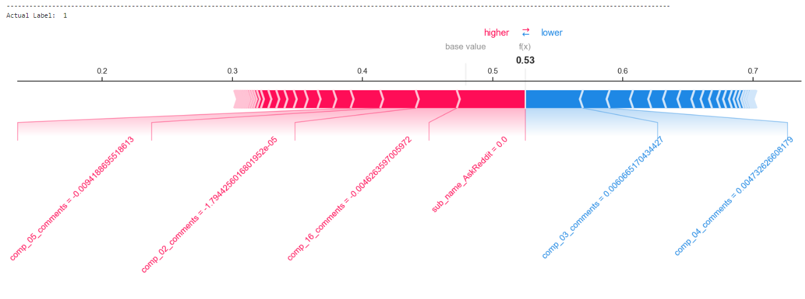
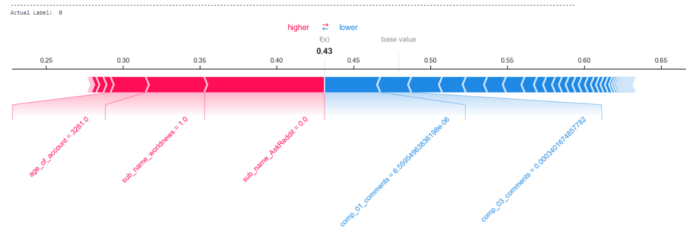
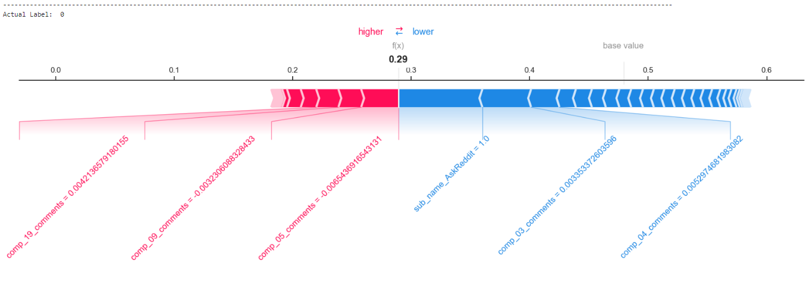
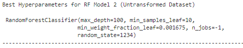
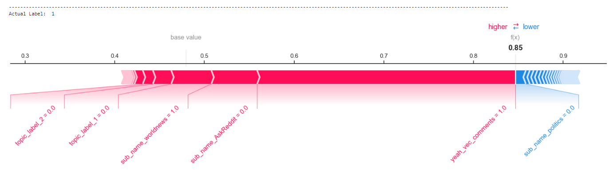
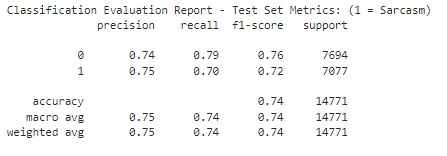
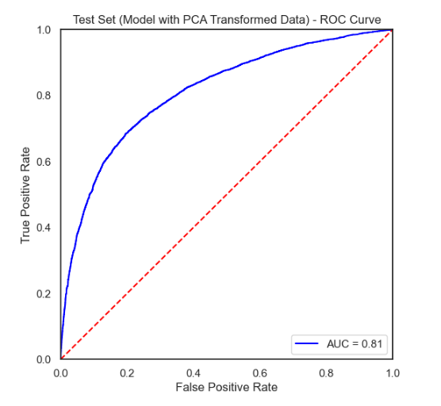
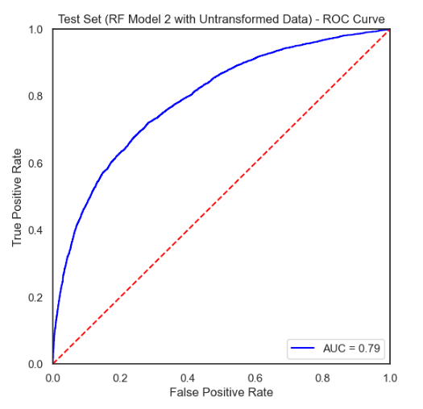

# Data Splitting and Sub-Sampling


### Data Partition Sets and Ratio of the Partitions

Before developing the predictive models, we decided to split our datasets into three subsets - `Training`, `Validation`, and `Testing`. The reason for choosing to divide the dataset into three sections are as follows:
* We wanted to ensure that we have a separate dataset for final testing that the model has never been exposed to and hence reducing the risk of overfitting our models on the test set. It provides us an `unbiased estimate` of how our models are peforming truly `on unseen data`. 
* Having a separate validation set allowed us to train our models on the training set and `fine-tune the hyperparameters` of the model by evaluating on the validation set and trying to improve the performance of the models on the validation set. This helped us keep the final test set intact and not use it anywhere in the training process. 
* Having a separate validation set also allowed us to perform model selection based on the validation set rather than the training set which could run the risk of overfitting. 

We started off with around `74000` rows of data in our overall dataset. We used a `60% - 20% - 20%` split ratio for our `Training - Validation - Testing` sets. This resulted in `44313 rows in our Training Set` and `14771 rows each in the Validation and Testing sets`. We utilized a `stratified sampling approach` for performing this split and the stratification was done based on two columns - `Subreddit Name` and `Target Label indicating Sarcasm/Not-Sarcasm`. This allowed us to ensure that equal ratios of the 3 subreddits were distributed across the three partitions of the data and more importantly we had equal ratios of the target label across the three partitions of the data. The reason for choosing the particular split ratio of `60% - 20% - 20%` are as follows:
* Choosing a 60% split ratio for the training set allowed us to ensure that we had enough data for the more complex ensmeble learning techniques like Random Forest to learn the patterns in the dataset and not end up overfitting on the training data. A 60% split resulted in almost 45000 data points for our training set which would be a decent dataset size for these complex models to learn well and avoid overfitting. 
* We wanted to ensure that the Validation and Test sets were very similar to each other because ensuring the the validation set is similar to the test set will allow the model to generalize well on the unseen test set too. This is because we will be using the validation set for performing all the model tuning and making adjustments to the model hyperparameters. We will be using the test set only for the final evaluations and reporting the final results of the model performance. Having a validation set that is similar in size and characteristics to the test set would be good for fine tuning the model. Hence, we decided to use 20% split ratios for both these sets. 
* Finally, a 20% split ratio for the test set resulted in almost 15000 rows for our test set. This allowed our test set to be a reliable dataset for testing how well our models would generalize on unseen data. The relatively large dataset size of around 15000 rows allowed us to ensure that the performance evalutions were not just a matter of chance or due to fluke and was a reliable indicator of model performance. 

Sample code Snippet for performing the data partitions  
```python
_X_train, X_test, _Y_train, Y_test = train_test_split(
    df[df.columns.difference(['label'])],
    df[['id', 'label']],
    test_size=0.20,
    stratify=df[['label', 'subreddit']],
    random_state=42
)
```

<br><br><br>

# Select Modeling Techniques

The objective of our modeling exercise is to `predict whether a particular comment on reddit is a sarcastic comment or not`. Hence, this will be treated a `Binary Classsification Problem` where the target variable is a `1/0 flag` indicating `Sarcasm(1) and Not-Sarcasm(0)`

As we have mentioned earlier, for this purpose we will be using a combination of text-related variables derived from the comments and the parent comments along with some numeric and categorical features. Brief recap of the features we will be using are as follows: 
* **Vectorized Text Features**: We will use TF-IDF scores to represent the text in each of the reddit comments and parent comments. This process has been covered in detail in the data preparation section above. 
* **Numeric Features**: We will include numeric features such as the number of upvotes, downvotes, score, karma gathered by the user, and age of the account to capture user engagement and history.
* **Categorical Features**: We will include the subreddit from which the comment was picked to indicate the topic of discussion as certain subreddits could have a higher inclination towards sarcasm.
* **Sentiment Analysis Metrics**: We will also use scores indicating the `scale of emotions` like `disgust, fear, trust, and surprise`. This metrics are obtained from the sentiment analysis exercise that we have carried out and the process has been covered in detail in the sentiment analysis section above. 
* **Topic Labels**: Through our topic analysis exercise, we have extracted a few broad topics that is being talked about in the comments. This process has also been covered in detail in the topic analysis section above. We will use these topic analysis labels to indicate which topic the comment is discussing about like `casual conversation, relationships & personal, politics & current events, mixed topics`.

With the objective and features available in consideration we have decided to use the following models for our predictive modeling exercise. We will be using two types of models with two types of variations in the input data finally resulting in four different models:
1. `Logistic Regression with PCA Transformed Input Features`
2. `Logistic Regression without Transformations (Base Input Features Used)`
3. `Random Forest with PCA Transformed Input Features`
4. `Random Forest without Transformations (Base Input Features Used)`

<br>

**Reasons for using two different types of input features - PCA Transformed & Untransformed**  
Having TFIDF vectorized text features results in a very high dimensional input dataset which can multiple issues in the predictive modeling process. It can also cause the very popular issue that has been termed as the `Curse of the Dimensionality` issue in predictive modeling. As the number of features increases, the volume of the feature space grows exponentially, leading to a sparsity of data. This can make it difficult for the model to capture meaningful patterns in the data, and can result in poor performance. Additionally, with an increase in the number of features, the model can become too complex and can start to fit the noise in the data, resulting in overfitting. This can lead to poor generalization performance on new data. Finally, having large number of features also increase the computation power required for training the models.   

Hence, due to these reasons, we decided to use PCA Transformed Inputs as one of the feature input types for our models. It can have the following advantages: 
* It reduces the dimensionality of the feature space, which can improve model performance by decreasing the risk of overfitting and reducing computational complexity.
* By reducing the dimensionality, it may also make it easier to visualize and interpret the text features.
* It can help to remove redundant or unimportant information from the text features, which may improve the interpretability of the model.

However, this can also come with multiple issues like reducing the dimensionality of the data can result in loss of information which can cause the model the lost some predictive performance. Another major issue is that transformation reduces the interpretability of the model by a large amount and it makes it difficult to understand which variables have a higher impact since the transformed features are linear combinations of the original features. Hence, for this reason, we have also decided to build models based on just the base features without transformations and compare these two sets of modeling iterations. 

**Reason for using Random Forest (RF)**  
Random Forest is a tree-based model that is suitable for both classification and regression tasks, which means it can handle predicting binary outcomes, like sarcasm detection.   
* It is know to be very robust since it is an ensemble learning model which uses a combination of multiple low-depth decision trees built on different feature subsets and finally uses and averaging appraoch to combine the results of these decision trees. This averaging appraoch reduces the risk of overfitting and improves the model's accuracy and generalization. It also provides a feature importance ranking, which allows us to identify the most important features that contribute the most to the prediction of sarcasm.
* Random Forest is known for its ability to handle high-dimensional data, which is a characteristic of vectorized text features and the combination of other numeric and categorical features. With the use of tf-idf scores, we can capture the importance of words within the text data and incorporate them as features in the model.
* Random Forest can also handle missing values in the data, which is a common issue in real-world datasets. This makes the model more robust and capable of handling incomplete or noisy data.
* It is known to work very well with tabular datasets and since we have a combination of vectorized text features and multiple numeric and categorical features, Random Forest seems to be a good choice. 
* Random Forest is also a relatively simple ensemble model that is easier to interpret compared to other more complex ensemble learning techniques like Gradient Boosted Decision Trees. It is definitely easier to interpret compared to Neural Networks. Interpretation is an important requirement for us since we want to understand the major contributors that help in identifying sarcasm. It is also relatively easier to train that more complex ensemble learning models like Gradient Boosted Decision Trees and Neural Networks. which requires more computing power for the training process and can be an overkill for smaller datasets. 

Hence, all these reasons make Random Forest a sensible choice for the problem that we are trying to tackle.


<br><br><br>

# Build the Models


### Random Forest with PCA Transformed Input Features (RF Model 1)

<br>

**RF Model 1 - Best Model Hyperparameters**  


* Max Depth of the Trees = 21
* Min Number of Samples in Leaf = 10
* Min Weight Fraction in Leaf = 0.00067
* Number of Estimators = 100

<br>

**RF Model 1 - Feature Importance Plot**  

We have extracted the feature importance values from the Random Forest Model built and shown the top 30 features in the bar plot below. 

From this bar plot we can see that the top 2 features in terms of importance are `Compoent 2 derived from the PCA transformation of the Comments TFIDF Vectors` & `Compoent 3 derived from the PCA transformation of the Comments TFIDF Vectors`. Component 2 seems to be disproportionately the most important feature in predicing sarcastic comments which indicates that it is probably composed of words or terms that show up in the comments that are very indicative of a comment being sarcastic or not. Most of these key terms or words have probably been condensed into these two top principal components. However, one issue assoicated with this interpretation is that we cannot actually identify what these components are composed of which reduces the explanability of the model. Hence, as we discussed earlier, we will also be building a model that is solely made up of untransformed features.

Analyzing this further, we can see from the feature importance plot that the `Name of the Subreddit`, the `Age of the Account` and also the `Score` obtained on the comment (Upvotes - Downvotes) are also good indicators of sarcasm in a comment. This could be because some more serious subreddits like `science` etc. would have less sarcasm whereas subreddits with hot and usually controversial topics like `politics` or subreddits made for `jokes` and `memes` could have more sarcasm going on. Age of the account could be a factor because it is more likely that seasoned users that have been using these platforms for a longer period of time could be more likely to comment something sarcastic. 


<br>


<br>

**RF Model 1 - Model Interpetation using Shapely Additive Explanations (SHAP)**  

We have used SHAP for obtaining a better and deeper interpretation of the Random Forest model developed. It uses game theory based concepts to attribute variable contributions to the overall predictions. SHAP works by using Shapley values to assign an importance score to each feature for a given prediction. The Shapley value of a feature is calculated by comparing the contribution of that feature to the prediction with and without it included. Specifically, SHAP estimates the expected value of the model's prediction when a feature is present (using a weighted average of predictions for all possible combinations of features), subtracts the expected value when the feature is absent, and averages the difference across all possible combinations of features. This yields the Shapley value of the feature, which represents its marginal contribution to the model's output.

We have randomly picked 2 sarcasm cases and 2 non-sarcasm cases from the test set to understand what makes the model predict something as sarcasm and something as not-sarcasm. This allows us to understand which features contribute the most. The red part indicates the the feature is pushing the prediction towards the positive class (Sarcasm in our case) while the blue part indicates negative shap values and large blue parts indicate that the variable is pusing the prediction towards the negative class (Not Sarcasm in our case)

* `Example 1 (Label = Sarcasm or 1)`: We can see from the plot below that the subreddit not being the AskReddit subreddit is contributing largely towards the comment being a sarcastic comment. This makes sense because AskReddit is usually a serious subreddit where people tend to ask serious questions and other people try to answer. Hence, it would make sense that these comments would have a lower amount of sarcasm. Other than this, we can also see that negative values of principal components like component 6 and component 2 contributing towards making a comment a sarcastic comment. However, as we mentioned before, it gets difficult to interpret these compoenents due to the transformations.



<br>

* `Example 2 (Label = Sarcasm or 1)`: We can see a similar pattern for the subreddit AskReddit in this case too. But the most important feature here seems to be the component 2 which seems to be making the largest contribution towards making a comment sarcastic. This indicates that component 2 could be composed of some word vectors that are usually very common among sarcastic comments. 


<br>

* `Example 3 (Label = Not-Sarcasm or 0)`: In this case too the comment not being from the subreddit AskReddit and the subreddit being world news seems to be pushing the comment towards being a sarcastic comment. This makes sense because world news could have people talking about politics and some controversial topics which also would have a higher chance of making something sarcastic. However, the positive values of Component 1 and Component 3 really pushes the prediction towards being Not Sarcasm. This indicates that these two principal components are probably composed of word vectors that usually have words that are not indicative of sarcasm. 



<br>

* `Example 4 (Label = Not-Sarcasm or 0)`: This case is also very similar to Example 3. However, it gets an even stronger push towards the comment not being Non Sarcastic because the flag for Subreddit AskReddit is 1 and it also has a large positive value for component 3. Hence, this is surely a serious or neutral comment that is definitely not sarcasm.




In summary, we have noted that more serious subreddits with more serious topics of discussion like AskReddit makes the comment more likely to be non sarcastic whereas subreddits with more hot topics or controversial topics of discussion like worldnews or politics could increase the chances of a comment being sarcastic. Additionally, we also noted that component 2 is potentially made up of word vectors that are very indicative of sarcasm whereas components 1 and 3 are made up of word vectors that indicative of something not being a sarcasm. We will need to use the untransformed model to actually understand what these words could be. This makes sense because there are some words that can have a very good indication of a sarcastic connotation like "Yeah, what a wonderful surpise". Here, someone could be talking about a statement that a politician has recently made and the combination of the words "Yeah" and "what" could also be a major contributing factor to the sarcastic connotation. Hence, from this analysis we can see that there are few key words that can have very strong sarcastic connotation and there are also certain topics of discussion that can generate more sarcastic comments. 

<br>

### Random Forest without Transformed Features i.e. using the base features (RF Model 2)

<br>

**RF Model 2 - Best Model Hyperparameters**  



* Max Depth of the Trees = 21
* Min Number of Samples in Leaf = 10
* Min Weight Fraction in Leaf = 0.00067
* Number of Estimators = 100

<br>

**RF Model 2 - Feature Importance Plot**  

Simialr to what we have done for RF Model 1, we have also extracted the feature importance values for RF Model 2. This one is easier to interpet since it has the actual words instead of the transformed components. We can see that the top features include the indication variables for the three subreddits - AskReddit, worldnews, and politics. 

In addition to this, we can also see key phrases or words like `"Yeah", "Right", "Sure", "Obviously"` coming up among the top features. These are all words that can have very strong sarcastic connotations. For example, the phrase `"Yeah, Sure! Why not"` could have a very strong sarcastic tone and there would be a very high chance that this comment was sarcastic depending on the context.

Other than this, we can also see that there are numeric features like `Score` (calcualted as Upvotes - Downvotes) of the comment and  `Age of the account` coming up among the top 15 features. This makes sense because some sarcastic comments with a funny tone or funny context could get very popular and have high scores. It can also even have extremely negative scores if the sarcastic comment appeared in an inappropriate context. Hence, sarcastic comments could have extreme values for scores. 

Finally, we can also see the `topic labels` extracted from the topic analysis showing up among the top features. These topics are also indicative of the broad topic of the comment and can serve a similar pupose to the subreddit name but at a more granular level. For example, Topic 2 indicates mixed topics and Topic 1 indicates conversations about relationship and personal matters. These two topics would ideally have a lower chance of having a sarcastic connotation. Whereas, Topic label 3 indicates politics and current events and that would ideally have a higher chance of being a sarcastic comment. Topic 0 indicates casual conversations with a lot of cuss words being used, so this topic could have more sarcastic cases too. Hence, it also makes sense that the topic labels are among the top variables. 


<br>

**RF Model 2 - Model Interpetation using Shapely Additive Explanations (SHAP)**  

Similar to RF Model 1 we have used SHAP for performing a deeper analysis of the variable contributions towards making a comment sarcastic or not sarcastic. This will help us dive deeper and understand what exactly contributes to making something a sarcastic comment. The untransformed features will also allow us to understand which words or phrases have a bigger contribution towards making something sarcastic. 

* `Example 1 (Label = Sarcasm or 1)`: This is a strong sarcastic comment and that is being driven due to multiple factors as we can see from the plot below. The comment is not from the AskReddit subreddit and it belongs to the politics subreddit. As we have mentioned earlier, political topics are more likely to generate sarcasm in the from of criticism. The other key variables related to the word vectors for the comments are also strong contributors. These are words like `need`, `world`, `people` which indicates that it is a political topic. `Need` is the most important contributor and it could be because the word might be used in a sarcastic context probably about something that is not actually needed. It seems to be a politics related critcism. For example, it would be used in a context like `I need more stress in my life` where it seems to have a very sarcastic tone. 


<br>

* `Example 2 (Label = Sarcasm or 1)`: This one is also a very strong sarcastic comment and the prediction is being driven by the word `Yeah` which is deinitely a very strong word related to sarcasm. For example, there are various scenarios wehre this could be used in a sarcastic connotation like `"yeah, right"`, `"yeah, that's totally believable"` or `"Yeah, like that's going to happen"`. This makes the presence of the word `yeah` a very strong indicator of sarcasm. This is even further corroborated by the subreddit indicator which indicates that the topic of discussion is related to `world news`. Further, it also does not belong to either Topic 1 or Topic 2 based on the topic analysis that was performed. All these combined makes it a very strong candidate for sarcasm. 



<br>

* `Example 3 (Label = Not Sarcasm or 0)`: This is an example that is not very straightforward. The topic of discussion is `politics` as indicated by the subreddit. However, the `Topic Label is 1` indicating that is is a discussion about personal opinions or relationships and it also does not contain the word `yeah`. These two variables combined drives it towards not being a sarcastic comment. It could probably be people having a personal conversation about a political topic. 


<br>

* `Example 4 (Label = Not Sarcasm or 0)`: This is a strong Non-Sarcastic comment being driven by two main factors. It belongs to the subreddit AskReddit indicating that it is either a neutral or a serious discussion. Additionally, the topic label indicator also shows us that it is a discussion about relationships or personal matters indicating that it could be serious or neutral discussion. 


In summary, based on the second Random Forest Models, we can make the following conclusions about what drives the comment to be either sarcastic or non-sarcastic. 
* Hot Topics that can trigger criticism and debate like `politics` and `worldnews` have a higher likelihood of being sarcastic
* Words and Pharases like `Yeah`, `Right`, `Sure`, `Obviously`, `Need`, etc. can have a very strong sarcastic connotation. Some examples are:
    `"yeah, right"`, `"yeah, that's totally believable"`, `"Yeah, because that's a great idea"`, `"Just what I needed."`, `"Sure, that's just what I wanted."`
* Neutral topics of discussion like casual conversations, relationhips and personal matters, questions, and serious topics have a higher chance of being non-sarcastic. 
* Sarcastic comments can have more extreme scores in terms of upvotes and downvotes. 


<br><br><br>

# Assess the Models


### Choice of Metrics

We decided to focus on `four key metrics` for assessing our models and all the assessment was carried out on the `test set` for assessing the final performance of the models. All the metrics mentioned in this section are reported based on the test set. These three key metrics are:
1. **`Precision`**: Precision tells us out of the cases that our model is predicting as Sarcasm how many cases are turning out to actually be sarcasm. In other words, it measures the accuracy of the positive predictions made by the model. Sarcasm can be a relatively quite difficult to identify since it is not a very simple and straightforward emotion. As such, we do not want the model to falsely predict the non-sarcastic cases as sarcasm which could have detrimental effects and increase the number of false positives. 

2. **`Recall`**: Recall tells us out of the actual Sarcasm cases that are there in the dataset, how many cases the model is able to predict correctly. A high value of recall would mean that the model is very accurate in capturing the sarcasm cases. Since, sarcasm is likely to be a relatively rare and difficult emotion to capture compared to other sentiments or emotions, it is important that we are able to capture the sarcasm cases correctly even at the cost of a few false positives. 

3. **`F1 Score`**: F1 Score takes into account both the Precision and Recall metrics that we have explained above. It is the harmonic mean of Precision and Recall metrics. It is calculated as  
$F_1 = 2 \times \frac{precision \times recall}{precision + recall}$  
Since, we want to have a good Recall score but not have too many false positives i.e. we do not want the precision to drop too low and start predicting a lot of Non Sarcastic cases as Sarcasm, it makes sense for us to focus on `F1 score` which will `take both Precision and Recall into account`.

4. **`AUC (Area Under the ROC Curve)`**: AUC-ROC measures the ability of a model to distinguish between positive and negative classes across all possible threshold values. In other words, it measures the overall performance of a model in terms of true positive rate (sensitivity) and false positive rate (1-specificity) across all possible decision boundaries. While for metrics like Precision, Recall, and F1 Score, we need to use a fixed decision boundary or threshold, for the AUC score we do not need to use any such boundary and we can gauge the performance of the model across different thresholds. It is also an useful tool for chosing the best thresholds.   
Focusing on AUC-ROC for sarcasm prediction is particularly useful because sarcasm is often a subtle and complex form of communication that can be difficult to detect accurately. A high AUC-ROC indicates that the model is able to effectively differentiate between sarcastic and non-sarcastic comments, which is a critical aspect of accurately predicting sarcasm. Additionally, AUC-ROC can be particularly useful in cases where the class distribution is imbalanced, which is often the case in sarcasm detection tasks where non-sarcastic comments are much more prevalent than sarcastic comments.

**Summary Table of Model Performances:**
<table>
    <thead>
        <tr>
            <th>S. No</th><th>Model Name</th><th>Model Description</th><th>AUC</th><th>F1 Score</th><th>Precision</th><th>Recall</th>
        </tr>
    </thead>
    <tbody>
        <tr>
            <td>1</td><td>LR Model 1</td><td>Logistic Regression with PCA Transformed Features</td><td>-</td><td>-</td><td>-</td><td>-</td>
        </tr>
        <tr>
            <td>2</td><td>LR Model 2</td><td>Logistic Regression without Transformation</td><td>-</td><td>-</td><td>-</td><td>-</td>
        </tr>
        <tr>
            <td>3</td><td>RF Model 1</td><td>Random Forest with PCA Transformed Features</td><td>0.81</td><td>0.72</td><td>0.75</td><td>0.7</td>
        </tr>
        <tr>
            <td>4</td><td>RF Model 2</td><td>Random Forest without Transformation</td><td>0.79</td><td>0.7</td><td>0.71</td><td>0.7</td>
        </tr>
   </tbody>
</table>


<br>

### Random Forest with PCA Transformed Input Features (RF Model 1)

**Strengths of the Model:**
* RF Model 1 has a very good AUC score of 0.81 which tells us that it does a decent job at segregating the sarcastic and non-sarcastic cases in the test dataset.
* The F1 score is also very decent for this model for both the classes. 0.72 F1 score for the sarcasm class and 0.76 F1 score for the non-sarcasm class. The Recall tells us that while this model is doing a decent job at predicting the sarcasm cases, it is doing an even better job at predicting the non-sarcasm cases i.e. there are a low number of False Positives in this model. 
* The confusion matrix tells us the observations we have made from the F1 score, Precision and Recall metrics. We can see that compared to the other models, this model is making a lower number of errors in terms of False Positives and is also able to capture a decent number of sarcasm cases correctly.

**Weakness of the Model**
* Compared to the RF Model 2, this model captures a slightly lower amount of sarcasm cases correctly at the cost of reducing the number of false positives. 
* While this is a very decent model, it still seems to not be able to capture a lot of sarcasm cases correctly based on the observations from the confusion matrix
* Finally, as we had seen earlier, even if this model is performing relatively better than the remaining models, the interpretation of this model is very difficult since it uses PCA transformed features and that makes it difficult to understand the true contributions of the various metrics. 

<br>

**RF Model 1 - Classification Report (Test Set)**  



<br>

**RF Model 1 - Area Under the ROC(Receiver Operating Characteristics) Curve (Test Set)** 



<br>

**RF Model 1 - Confusion Matrix (Test Set)** 


<br>


### Random Forest without Transformed Features i.e. using the base features (RF Model 2)

**Strengths of the Model:**
* This model has a very decent AUC Score at 0.79 which indicates that this model is also able to segregate the sarcasm and not-sarcasm cases in a very decent manner. 
* The most major strength of this model is its interpretability without a major loss of performance. Since we are using the base untransformed features for this model, we can easily interpret which input variables have a higher contribution towards making a comment sarcastic or not. 

**Weakness of the Model**
* Compared to RF Model 1, this model seems to have a lot more False Positives. It is able to capture a slightly more number of sarcasm cases correctly but it does so at the cost of a lot more False Postitives. Hence, the large number of False Positives is definitely one of the major weaknesses of this model. 
* Due to the higher number of False Positives, it is also not able to capture some cases of Not-Sarcasm correctly and performs worse than the RF Model 1 in terms of F1 score and Recall for the Not-Sarcasm class.

<br>

**RF Model 2 - Classification Report (Test Set)**  


<br>

**RF Model 2 - Area Under the ROC(Receiver Operating Characteristics) Curve (Test Set)** 



<br>

**RF Model 2 - Confusion Matrix (Test Set)** 


<br>


### Choice of Final Model

Based on all the observations above, our final recommendation is to use the `RF Model 2` as the final model `if interpretation is a major requirement`. We are recommending this because it performs very well in terms of most of the metrics and is not very far behind RF Model 1 in terms of performance. However, it has a much more superior interpretability without a major loss of performance. Additionally, it also performs slightly better in predicting actual Sarcasm cases albeit at the cost of a few additional false positives.
* Performance Metrics for RF Model 2:
    * `AUC Score`: 0.79
    * `F1 Score`: 0.70
    * `Recall`: 0.70
    * `Precision`: 0.71

Our second recommendation is that if we are more interested in the predictive power of the model and correctly predicting both the sarcasm and non-sarcasm cases correctly, and interpretability if not a major requirement, then, `RF Model 1` is the better choice of model. It has a much lower number of False Positives and performs very well for both Sarcasm and Non-Sarcasm cases. This is a good model too, if we want to are interested in reducing the number of false positives.
* Performance Metrics for RF Model 2:
    * `AUC Score`: 0.81
    * `F1 Score`: 0.72
    * `Recall`: 0.70
    * `Precision`: 0.75