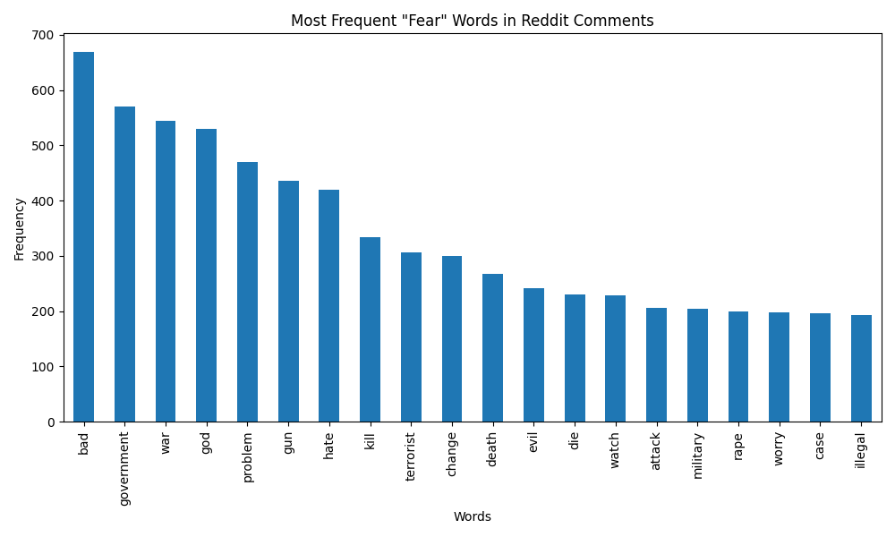
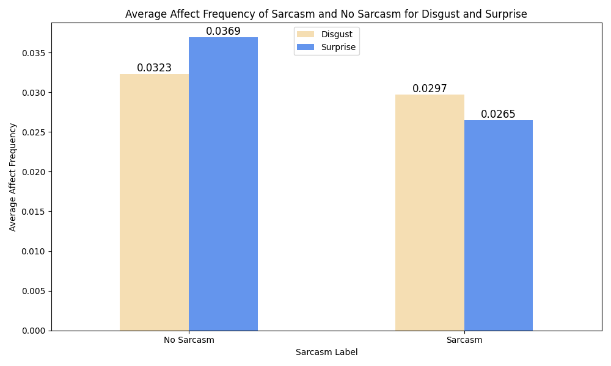
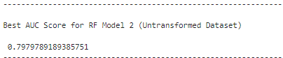

# **Detecting Sarcasm in Social Media Comments**

# Executive Summary
Our project aims to detect sarcasm in social media comments using Reddit data from 2009 - 2016. The rise of social media has led to an increase in online communication, which has led to a rise in the use of sarcasm. According to Wong (2022), the use of irony can make it difficult for social networks to determine the intention of a user, while also allowing for some degree of denial.**<sup>[1]</sup>** For example, racist comments written with irony on online platforms may go undetected and cause disharmony. Moreover, detecting sarcasm in social media comments can have various benefits, including capturing the intention of the user and facilitating online advertisement. For example, sarcastic comments that would otherwise go unnoticed could be detected, enabling the capture of user intention and thus, avoiding the presentation of irrelevant ads. As an instance, if a user leaves a sarcastic comment on a certain automobile feature online, detecting the sarcasm can allow the marketing agents to avoid presenting ads about automobile features that the user does not like. However, accordiong to Peters (2018), detecting sarcasm in online communication is difficult due to the lack of non-verbal cues.**<sup>[2]</sup>** 

Our project aims to solve this problem by using machine learning techniques to analyze Reddit data and identify patterns that indicate sarcasm. By accurately detecting sarcasm, we can improve the effectiveness of sentiment analysis and improve our understanding of online communication. Our recommendations include developing a machine learning model that can accurately detect sarcasm in social media comments. This model can be used by social media platforms to improve their sentiment analysis capabilities and better understand user behavior. This project benefits social media platforms, businesses, and researchers who are interested in understanding online communication and sentiment analysis, especially those who wish to maintain harmony on online platform and those who wish to devise a new online marketing strategy. 

**Team Members:**

- Frankle Muchahary
- Jayke Ratliff
- Omkar Patade
- Shreyan Datta Chakraborty
- Roe Djer Tan 

<br><br>

# Statement of Scope

For this project, we will be focusing on a `specific sub-type of sentiment analysis` which is `detecting the presence of sarcasm in social media comments`. The social media platform that we will be focusing on for our project is `Reddit` mainly due to the availability and easy access of large amounts of anonymous data. Our attempt is to build a binary classification model that can utilize both text data and other numeric data to predict the presence of sarcasm in a tweet. Our goal is build a model that can generalize well universally, however, it is important to note that the observations or findings from our project and the predictive models built for our project might not necessarily translate well to all social media platform comments. 

This exercise is done based on the data gathered from Reddit (obtained through a Kaggle dataset). In addition to the Kaggle Dataset we have also gathered supporting data on our own by scraping user-related information from Reddit. The comments that we have used for our project are limited to 3 very popular subreddits on Reddit - `AskReddit`, `politics`, and `worldnews`. Hence, we would also like to note that the observations made from our project might not always necessarily translate well to some topics like `sports`, `science`, or `technology`.  For this project, we will be trying to develop a way to predict sarcastic comments based on the `comments` itself and the related `parent comment` which will further be supported with numeric metrics like `upvotes`, `downvotes`, `karma`, etc. 

Finally, the project objectives are: 
* `Topic Analysis` (Unsupervised Machine Learning Problem): Identifying which topics are popular in sarcastic comments compared to the ones that are popular for non-sarcastic ones. 
* `Binary Classification` (Supervised Machine Learning Problem): Building a binary classification model for predicting whether a comment is sarcastic or not.

Unit of Analysis: A comment in Reddit <br>


<br><br>

# Project Schedule

We have divided the project into 5 different phases in order to be able to tackle the different pieces of the project in a much more structured manner. These phases are the following: 
* `Phase 1:` This phase involves definining the problem statement and brainstorming for various ideas, data sources, and access techiniques
* `Pahse 2:` In this phase we will be extracting data from different sources and cleaning the obtained data
* `Phase 3:` We will begin with the data transformation and reduction steps in this phase of the project
* `Phase 4:` Exploratory Data Analysis will be carried out on the cleaned and transformed datasets in this phase of the project. We will try to generate insights and identify which variables or metrics could help us in the predictive modeling phase of the project. We will be completing all the tasks till phase 4 for Project Deliverable 1.
* `Phase 5:` In this phase we will mostly be focusing on developing predictive models for our task i.e. Detecting Sarcasm in Reddit Comments and generating insights based on the model outputs. This phase will be carried out for Project Deliverable 2.

A detailed description of the tasks for each phase and the respective task owners have been shown in the timeline chart below. 

The snapshot of our project timeline has been shown below. However, the latest timeline could change due to various circumstances and the latest project schedule/timeline can be accessed through this [link](https://ostatemailokstate-my.sharepoint.com/:x:/g/personal/frankle_muchahary_okstate_edu/EYBcPhLyA1xGmlLA0gCi06oBLNKqCMFBKHXVvaekHbJZyA?e=ZilqS3).

<br>


<br><br>

# Data Preparation

The data preparation process for this project includes obtaining data from `Kaggle`, extracting additional user-related information through scraping, cleaning the data, carrying out preprocessing for the text columns in the dataset, and finally consolidating the datasets obtained from different sources or preprocessing methods into a combined master dataset that can be used down the road for predictive modeling purposes. A majority of the data preparation was carried out using python and the following python libraries were used for the data preparation process: `asyncio`, `beautifulsoup4`, `dateutil`, `multiprocessing`, `nltk`, `pandas`, `requests`, and `scikit-learn`

<br>

The data prepration process for this project begins with gathering data from two sources. The primary focus of the project is to detect the presence of sarcasm in various texts. It is a specific sub-area of sentiment analysis. For this purpose, we obtained a `dataset from Kaggle containing Reddit comments` along with additional continuous and categorical features like upvotes, downvotes, usernames, subreddit names, etc. The dataset has also already been labeled as either `Sarcasm` or `Not Sarcasm`. In addition to this, we also obtained additional information about the users and their Reddit usage history by `scraping user-related information from Reddit` using the usernames that were available in the Kaggle dataset.  

<br>

The data access process was followed by cleaning and extraction of relevant data from both the scraped data and the `text columns (comments and parent comments)` available in the Kaggle dataset. The cleaning process included the extraction of `relevant user information like karma points, awards, etc.` from the scraped HTML data. The comments data also went through a cleaning process that involved the usual steps followed for cleaning text data like lowercase conversion, removing punctuations and numeric characters, lemmatization, etc.

<br>

The cleaning step was then followed by `tokenization` and `vectorization` of the text comments data to convert them into a format that is usable for predictive modeling. This vectorization step produces a high-dimension dataset with a large number of columns. Hence, in order to reduce the dataset size, a `data reduction step using PCA` was also utilized to convert the dataset into a more manageable size.

<br>

Finally, the data preparation process ends with a consolidation step that involved combining together all the datasets obtained from the different sources and outputs from different preprocessing steps into a combined master dataset that can be used readily for further steps of the project. The datasets and code files used for each step are available below.

<br>

**Datasets:**
* [base-data-sarcasm.csv](data/base_data/base-data-sarcasm.csv): Base Dataset containing reddit comments and sarcasm labels obtained from *Kaggle*
* [user_info.csv](data/user_data/user_info.csv): Scraped and Cleaned User Info Data obtained from *Reddit*
* [final_master_data.csv](data/final_data/final_master_data.csv): Final Merged Master data to be used for Predictive Analytics. Contains all comment related metrics, vectorized and reduced text data,  user related metrics, and also the original comments.

**Code Files:**
* [scrape_clean_user_info.py](code/scrape_user_info/scrape_clean_user_info.py): Python code for scraping and cleaning user information from Reddit using the usernames available in the base dataset
* [text_cleaning_vectorization.py](code/text_data_prep/text_cleaning_vectorization.py): Python code for cleaning the base data and converting the text data numeric vectors
* [data_cleaning_transformation_and_reduction_comments.py](code/data_cleaning_transformation_and_reduction_comments.py): Python code for cleaning the vectorized data for the comments file and applying PCA
* [data_cleaning_transformation_and_reduction_parent_comments.py](code/data_cleaning_transformation_and_reduction_parent_comments.py): Python code for cleaning the vectorized data for the parent comments file and applying PCA
* [combine_two_datasets_along_with_the_target_variable.py](code/combine_two_datasets_along_with_the_target_variable.py): Python code for creating the final data set along with the target variable and joining the two datasets on which PCA has been done
* [visualization_and_eda.R](code/visualization_and_eda.R): R code used for performing *Exploratory Data Analysis* and creating visualizations for the exploratory analysis using ggplot.

<br>

### Data Access
The data access step for this project involves obtaining dataset from two different sources: a pre-curated and pre-labeled dataset obtained from Kaggle and scraped user-related information obtained by scraping user pages on Reddit. Both these steps have been explained in detail below.

<br>

**Source 1: Pre-curated and pre-labeled sarcasm dataset obtained from Kaggle**   
A dataset containing 1.3 million Reddit Comments and other details related to the comments like number of upvotes, number of downvotes, name of the author, etc. was published on arXiv by Khodak et al. as a part of their article titled *“A Large Self-Annotated Corpus for Sarcasm”* to enable research on sarcasm detection and for training machine learning models that are capable of sarcasm detection.**<sup>[3]</sup>**  This dataset was also made available on Kaggle by the user Dan Ofer as a part of Kaggle Datasets.**<sup>[4]</sup>**  This dataset is a very rich dataset containing of a large number of reddit comments and well validated target labels generated by researchers which makes it a very reliable data source free from discrepancies. Additionally, Reddit is popular for being an anonymous social media platform which makes it a good source for obtaining user related information because the chances of breaching user privacy is lower due to the aspect of anonymity. Finally, the researchers that curated the data have also attempted to make the dataset relatively well balanced in terms of number of sarcastic and non-sarcastic comments. All these factors combined together make this a very solid dataset for analyzing sarcasm.    

Out of the original 1.3 million comments we have used a smaller sample consisting of around 7% of the dataset for use in our project to ensure a more manageable dataset size. We did this by considering only the top 3 subreddits available in the dataset based on the number of comments. These subreddits are `AskReddit`, `politics`, and `worldnews`. The total number of comments after sampling totaled to rougly 75K comments and the total number of users available to us in this sampled dataset is around 45K.   

The following variables are available in the dataset: *sarcasm label, reddit comment made by the author (text column), author of the comment (username), subreddit name, comment score, number of upvotes on the comment, number of downvotes on the comment, comment date, comment full timestamp, parent comment (text column), and a unique id for each comment.*  

<br>

`Basic Summary of the Dataset Obtained from Kaggle: `  


<br>

**Source 2: Scraped User Information obtained from Reddit**  
In order to consolidate the dataset obtained from the first source explained above, we have also scraped additional information mainly related to Reddit usage history for all users. This step uses the `author of comment (reddit username)` available in the dataset obtained from the first source to obtain the additional user information. 
In order to begin scraping, we first construct the URL that needs to be scraped for each user. The username is passed as a parameter to the following URL:  

https://old.reddit.com/user/ThisIsNotKimJongUn/gilded/  

In the above URL, the term between `user` and `gilded` which is `ThisIsNotKimJongUn` in this particular example is the Reddit username available to us in the author column of the dataset obtained from the first source. Hence, we loop through the dataset and construct this URL for each user before beginning the scraping process.
The URL mentioned above provides us with the following information about the user:
* `Post Karma` (Karma is the points system on Reddit. Similar to likes on other social media platforms) the user has obtained through posts created by them on Reddit.
* `Comments Karma` the user has obtained through comments they have made on Reddit.
* `Joining Date`
* `Gilded Posts or Comments`. A comment or post is considered gilded if the user receives some awards for their comments or posts. Usually comments that are considered extremely good by other users are the ones that receive awards. These comments usually tend to be extremely funny or highly sarcastic. Hence, these can help in potentially detecting sarcasm.   

A snapshot of the webpage and the content that we are trying to extract from the webpage has been highlighted in green in the image shown below.   


<br>

The two images shown below highlights the HTML elements corresponding to the content that we are trying to scrape from the webpage. These are the HTML elements that we will be extracting using the library `beautifulsoup4`.


<br>


<br>

Hence, to conclude, the scraping process involves three key steps which are as follows:
1. Construct URLs like the one shown above for all 45K users available in the dataset.

2. Fetch the HTML content of the webpage using the `requests library` in python. This process is being carried out in an asynchronous manner using the `asyncio libary` because we have around 45K webpages to fetch the HTML content from which takes a lot of time. Hence, by making this process as an asynchronous process, we are able to scrape the HTML content for 1000 users in parallel. This helps in speeding up the process by a significant amount. The following snippets of code are used for carrying out this process. 

```python
try:
    headers = {
        'User-Agent':UA_LIST[randint(0,4)]
    }

    rq_result = rq.get(
        url,
        headers = headers,
        timeout = 10
    )

    return rq_result

except Exception as e:
    err = (url, str(e))
    ERRORS_LIST.append(err)

``` 

```python
for single_batch_url_list in tqdm(url_list_chunks[0:dry_run_index1]):
    event_loop = asyncio.get_event_loop()
    
    # asynchronous call to the wrapper function
    Executor = ThreadPoolExecutor(max_workers=len(single_batch_url_list))
    tasks = [event_loop.run_in_executor(Executor, async_request_extract_html_wrapper, url) for url in single_batch_url_list]

    #single_batch_result = await asyncio.gather(*tasks)
    single_batch_result = event_loop.run_until_complete(asyncio.gather(*tasks))

    all_results_list.extend(single_batch_result)
```

3. Finally, in the third step of the process we use the `beautifulsoup4 libary` in python to obtain the relevant HTML elements shown in the images above by accessing through *class* and *id* attributes. Based on this, we have extracted the required user information for further use in our analysis. Sample code snippets used for this process have been shown below. 

```python
html_result = BeautifulSoup(rq_result.content, "html.parser")

### extract post karma obtained by user
extracted_elem = html_result.find(
    'span', {'class':'karma'}
)

### extract number of comments/posts the user received awards for - gilded posts and comments
all_gilded_posts = html_result.find_all(
    'div', attrs={'class':['gilded', 'thing']}
)
```

<br>

### Data Cleaning

The data cleaning process in this project consisted of multiple segregated sections that were applied at various points and on different datasets used in the project. 

**Text Data Preprocessing (For `comment` and `parent_comment` columns)**

In order to be able to use the text for exploratory analysis and predictive analysis down the road, we need to clean up the text data and convert it into a standard format. This will help us in extracting meaningful insights from our analysis and avoid drawing faulty conclusions. The text cleaning process involves the following different steps:

1. **Lowercase Conversion:** We have converted all the comments and parent comments into lower case to ensure a consistent format and to ensure that words like `happy` and `Happy` are not being considered as different words just due to their casing conventions.  
The following code snippet was used for performing this analysis:
```python
    # convert to lowercase
    self.df['cleaned_'+self.text_column_name] = self.df[self.text_column_name].str.lower()
```

2. **Removing Special Characters and Numbers from Text:** Following the lowercase conversion step mentioned above, the next step of the process involves removing special characters like `#, &, @` etc, and `numeric characters` to keep only the white spaces and text characters. This has been done to ensure that we consider only meaningful characters in our comments and parent comments and not considering a special character that has a high occurence as an individual entity later on while vectorizing the text.
The following code snippet was used for performing this analysis:
```python
    # remove numeric values - keep text only
    self.df['cleaned_'+self.text_column_name] = self.df['cleaned_'+self.text_column_name].str.replace("[^a-zA-Z']", " ", regex=True)
```

3. **Remove Stopwords:** Stopword removal is an important step while performing text analysis. Stopwords are usually words like `the`, `a`, `an`, `and`, `in`, etc. These words do not usually carry much meaning or add a lot of information to the overall context of the sentence. These words do not help us a lot in understanding the meaning of the sentence and act more like noise. Additionally, these words will also have high occurences and will overshadow other more meaningful words. Hence, removing these words will help improve the quality of our analysis.  
The following code snippet was used for performing this analysis:
```python
    def remove_stopwords(self, txt):
        '''
        helper method for removing stopwords
        '''
        txt = txt.split(' ')

        txt = [i for i in txt if i not in self.eng_stopwords]

        final_txt = ' '.join(txt)

        return final_txt
```

4. **Lemmatization:** Lemmatization is a very important and popular step carried out before any text analysis process. It can help us standardize the text columns and group together words that are similar to each other like `dance` and `dancing`. In the lemmatization process, the `ing` part of the word will be removed and both the words will now be considered the same in any future analysis that is carried out after lemmatization. This can help improve feature extraction from text, ensure better standardization of words during the vectorization process, and also improve the comprehension of text. It is similar to the `stemming` process but stemming does not ensure that the resultant words are meaningful and just utilizes rules to remove the suffix from words. While this can make stemming a faster process, `lemmatization can be a more thorough process and result in meaningful words, thus ensuring better comprehension`. Hence, in the final step of the text cleaning process, we have used lemmatization.  
The following code snippet was used for performing this analysis:
```python
    def _tokezine_lemmatize(txt):
        '''
        helper method for tokenizing and lemmatizing
        '''
        tokenized_txt = word_tokenize(txt)

        wordnet_lemmatizer = WordNetLemmatizer()

        lemmatized_txt = [wordnet_lemmatizer.lemmatize(w) for w in tokenized_txt]

        final_txt = ' '.join(lemmatized_txt)

        return final_txt
```

<br>

Examples of a few comments from before and after applying the above mentioned 4-step cleaning process has been shown below:

`Examples of Comments Before Cleaning:`
<pre>
- Oh, I never realized it was so easy, why had I, and every other lonely person on earth never thought of that before?

- And even wars such as Egyptian Unification war, a whopping 5316 years ago (Ish)

- I think he misspelled "Speed"
</pre>

`Examples of Comments after cleaning with the 4-Step cleaning process mentioned above:`
<pre>
- oh never realized easy every lonely person earth never thought

- even war egyptian unification war whopping year ago ish

- think misspelled speed
</pre>


<br>

**Cleaning Scraped HTML for User Data and Creating a DataFrame**

A cleaning process has also been carried out for the user data that was scraped form Reddit `(Source 2 Data mentioned above)`. This was carried out because the user information scrapred from Reddit was not always clean and not always in the correct format and hence some basic cleaning process were carried out. The following cleaning steps were carried out:  

1. **Cleaning Post/Comment Karma and Converting to Numeric Data Type**: The post and comment karma numbers were stored as text format and had comma separations within the numbers. We removed the commas from and converted the numbers from text format to numeric format. The missing values were then imputed with 0 values.  

Code snippet used for cleaning:
```python
if extracted_elem is not None:
    comment_karma = extracted_elem.text.replace(',', '')
    comment_karma = int(comment_karma)
else:
    comment_karma = 0
```

Examples:
```
Original Comment Karma:  <span class="karma comment-karma">355,040</span>

Cleaned Comment Karma:  355040
```

2. **Converting User Joining Date from Text to Date Type**: The user joining date was extracted and converted from a string format to a date time format by parsing the string as date time using the `dateutils` library. Additionally, all missing dates were imputed as `17th March 2023`. 

Code snippet used for cleaning:
```python
if join_date is not None:
    join_date = dp.parse(join_date['datetime']).date()
else:
    join_date = dp.parse('17 March 2023').date()
```

Examples:
```
Original Date String:  '2015-01-29T16:58:17+00:00'

Cleaned Date:  datetime.date(2015, 1, 29)
```

3. **Extracting User's List of Gilded Subreddits and Storing as a list**: All the list of user's subreddits where they either have a gilded post or gilded comment has been extracted and the extracted text has been stored as a list of strings. For cases where the user does not have any gilded posts or comments in any subreddit, it has been imputed with an empty list. 

Code snippet used for cleaning:
```python
all_gilded_posts = html_result.find_all(
    'div', attrs={'class':['gilded', 'thing']}
)
num_gilded_posts = len(all_gilded_posts)


### extract the list of subreddits the user received awards in
gilded_subreddits_list = [i['data-subreddit'] for i in all_gilded_posts]
```

Examples:
```
['ContagiousLaughter',
  'instant_regret',
  'pics',
  'gaming',
  'politics',
  'Showerthoughts']
```


<br>

**Data Cleaning after Vectorization**

We ended up creating two data sets, one for the comments section and the other for the parent_comments section. We used tf-idf vectorizer to convert the text data into different tokens that are going to aid us in fitting predictive models for the next part of the project. The same cleaning procedures were used for both the data set. The screenshot of the two sample data sets is shown below. The first screenshot of the sample comments and the second screenshot is for the parent comments. 


As seen in the two screenshots, there were quite a few null values in the data set. We realised that a few of these values occured due to the exporting of the data frames into a csv and then importing it back to perform further operations. We have dropped this null values but have kept a note of the index for which we are dropping these values as we need to consolidate the data later on. No treatment of the extreme values were so that no bias were introduced in the dataset. We are already vectorizing the text data, that itself is an operation that introduces some sort of biasedness. 


<br>

### Data Transformation
There we three kinds of data transformations carried out. These transformations have been explained below.   

**Text Data Transformation (TF-IDF Vectorization)**  

The most noticeable transformation out of all the transformations was converting the comments into tokens and then followed by creating TFIDF vectors for all the top occuring words. The vectors were limited to the top 70 words based on frequency and we limited to an upper limit n-gram of 3 and a lower limit n-gram of 1. This means that we will have individual words like `world`, `politics`, etc. being treated as individual vectors but we could also have words pairs and triplets like `yeah, sure` or `i am fine` being treated as individual word vectors. We wanted to be able to capture some semantic meaning and hence we decided to utilize this range of single words to word triplets. These steps were carried out after the text data cleaning steps mentioned above were performed.  

The reason for performing this vectorization steps was because most machine learning and statistical algorithms will not be able to parse text data directly and we will have to convert them into some form of numeric measure or numeric vectors on which we can apply machine learning algorithms to identify useful patterns. The vecotorization step has been used to perform this step and the numeric metric we have used for the vectors is `TFIDF score (Term Frequency - Inverse Document Frequency)`. There are different ways to create vectors with the most basic one being `Count Vectorization` where we simply calculate the count of occurences of each word. `TFIDF score is a slightly more robust and better metric` because this metric applies a weight to the occurence of each word based on how frequent or rare they are in the entire corpus. Hence, based on the TFIDF score, words that are very frequent in a document but very rare in the corpus will have higher weights. This can help us avoid giving too high weightage to very common and generic words like `book`, `car`, etc. by penalizing them and providing higher weightage to words that are generally rare in the corpus. `TFIDF Score` is usually calculated as a product of the term frequency (proportion of frequency of a word in a document) and the inverse document frequency (number of documents in a corpus divided by the total number of documents in the corpus where the term occurs. this value is usually log scaled.)

Hence, it can be represented as:

$\text{TF-IDF}(t, d, D) = \text{tf}(t, d) \times \text{idf}(t, D)$

where:

* $t$ is a term (word) in the document
* $d$ is a specific document in the corpus
* $D$ is the entire corpus
* $\text{tf}(t, d)$ is the term frequency of term $t$ in document $d$
* $\text{idf}(t, D) = \log{\frac{N}{n_t}}$ is the inverse document frequency of term $t$ across the entire corpus $D$, where:
    * $N$ is the total number of documents in the corpus
    * $n_t$ is the number of documents in the corpus that contain term $t$


Code Snippet Used for Vectorization:
```python
    tfidf = TfidfVectorizer(
        ngram_range=(1,3),
        max_features=70,
        strip_accents='unicode',
        use_idf=True,
        smooth_idf=True,
        min_df=0.0,
        max_df=0.80
    )

    comments_tfidf = tfidf.fit_transform(
        self.df['cleaned_'+self.text_column_name]
    )
```

The output from the above mentioned process generates a very high-dimensional and a sparse dataset. Hence, we will later be applying data reduction methods on it to reduce the dimensionality of the datasets.     
Sample Output from the Vectorization Process:    


<br>

**Transformation for Numeric Metrics**

Some of the numeric metrics like `score`, `ups`, `comment_karma`, and `post_karma` were found to have high values of right-skewness. These variables were transformed to make the distribution more even and help us in the predictive modeling phase later down the road. The before and after transformation summary of a few metrics like `skewness`, `kurtosis`, and `standard deviation` along with the transformation applied have been shown in the tables below. We can see that before the transformation, the skewness and kurtosis values are very extreme. We can also see that after the `log transformations` the metrics have improved drastically the both the skewness and kurtosis are now quite close to zero.

<table>
    <tr>
        <td colspan="6">Before Transformation</td>
    </tr>
    <tr>
        <td>#</td>
        <td>Variable Name</td>
        <td>Transformation Applied</td>
        <td>Skewness</td>
        <td>Kurtosis</td>
        <td>Standard Dev</td>
    </tr>
    <tr>
        <td>1</td>
        <td>score</td>
        <td>None</td>
        <td>30.24991089</td>
        <td>1258.073068</td>
        <td>77.02079734</td>
    </tr>
    <tr>
        <td>2</td>
        <td>ups</td>
        <td>None</td>
        <td>32.69338315</td>
        <td>1456.851374</td>
        <td>68.00517955</td>
    </tr>
    <tr>
        <td>3</td>
        <td>comment_karma</td>
        <td>None</td>
        <td>7.827710191</td>
        <td>114.4187445</td>
        <td>104140.5426</td>
    </tr>
    <tr>
        <td>4</td>
        <td>post_karma</td>
        <td>None</td>
        <td>66.83917111</td>
        <td>6445.039043</td>
        <td>75630.51194</td>
    </tr>
</table>

<br>

<table>
    <tr>
        <td colspan="6">After Transformation</td>
    </tr>
    <tr>
        <td>#</td>
        <td>Variable Name</td>
        <td>Transformation Applied</td>
        <td>Skewness</td>
        <td>Kurtosis</td>
        <td>Standard Dev</td>
    </tr>
    <tr>
        <td>1</td>
        <td>score</td>
        <td>Log</td>
        <td>-0.973381061</td>
        <td>2.937969446</td>
        <td>1.844805272</td>
    </tr>
    <tr>
        <td>2</td>
        <td>ups</td>
        <td>Log</td>
        <td>-0.993396973</td>
        <td>2.793959394</td>
        <td>1.864830493</td>
    </tr>
    <tr>
        <td>3</td>
        <td>comment_karma</td>
        <td>Log</td>
        <td>-0.692805602</td>
        <td>-1.344020278</td>
        <td>6.812369526</td>
    </tr>
    <tr>
        <td>4</td>
        <td>post_karma</td>
        <td>Log</td>
        <td>-0.382880743</td>
        <td>-1.470978387</td>
        <td>5.720276132</td>
    </tr>
</table>

<br>

**Transformations of the Vectorized Values**  

We wanted to get the entirety of the numerical data in the same scale and therefore we wanted to normalize the data using the Z-score transformation. This ensures that the mean of the variables become 0 and the standard deviations are 1. This helps us in creating the covariance matrix and understand the linear spread of the data amongst variables. The following are the screenshots of the sample datasets of comments and parent comments respectively. 


Here, we can see that a lot of the entries have same values within a column for different columns. This is because a lot of the entries had the value zero before normalization and therefore to make sure that the overall column mean is 0 along with the fact that the column standard deviation should be 1 a lot of the entries have the same value. 


<br>

### Data Reduction
In the two datasets (comments and parent comments) that we just described, each of them had 73 columns and over 74000 rows. We needed to reduce the data in order to understand the data better and at the same time fitting algorithms on a smaller data is easier. And therefore we performed `Principal Component Analysis (PCA)` on each of the two datasets. Following is the detailed process of PCA performed on the two datasets:
1. Comments Data:
First, we dropped the columns that had the original and the cleaned text data in them along with the unique 'id' variable. After the aforementioned Z-score was done, we looked at the eigen values to understand the variance explained by each of the eigen vectors (and therefore each of the Principal Components). The cumulative sum of the eigen values gave us an idea about the percentage of variance explained based on the number of principal components. Below is the scree plot that showcases the optimum number of principal components to select based on the variance explained. 

Based on this plot (and computational feasibility) we have chosen 20 principal components that explain 35.42% of the variance. After the PCA was done, we added back the columns with text along with the 'id' column to get a better understanding of the data. 

2. Parent Comments Data:
First, we dropped the columns that had the original and the cleaned text data in them along with the unique 'id' variable. After the aforementioned Z-score was done, we looked at the eigen values to understand the variance explained by each of the eigen vectors (and therefore each of the Principal Components). The cumulative sum of the eigen values gave us an idea about the percentage of variance explained based on the number of principal components. Below is the scree plot that showcases the optimum number of principal components to select based on the variance explained. 

Based on this plot (and computational feasibility) we have chosen 15 principal components that explain 26.33% of the variance. After the PCA was done, we added back the columns with text along with the 'id' column to get a better understanding of the data. 

### Data Consolidation

In this final step of our data prepration process, we will be combining all the data generated from different steps of our data cleaning and transformation pipeline along with the original base dataset and the scraped dataset to create a final master dataset that will be used for all further predictive analytics process. 

After performing PCA on two data sets (comments data and parent comments data) we have combined them to make one final dataset. We used the `id` as a primary key to merge these two data sets and an inner join was used to keep just the common records among the two datasets. The following code snippet shows how this process was done.

```python
df_combined = pd.merge(
    df_reduced_comment,
    df_reduced_p_comment,
    how='inner',
    on = 'id'
)
```

After the above process, we used the `id` variable to map the `label` to each row that signifies whether the comments and parent comments are sarcastic or not. This variable was obtained from the `base dataset`. Along with this, other numeric metrics obtained from the base dataset like `score`, `ups`, `downs`, `date`, etc. were also joined. This join was also an inner join.

```python
df_final = pd.merge(
    df_combined,
    df_base_1,
    on='id',
    how='inner'
)
```

Finally, in the final step of the process, we joined the `users dataset` with the merged datasets obtained from the above merging process. This allowed us to obtain user level metrics like `comment_karma`, `post_karma`, `gilded_subreddits`, `join_date`, etc. For this join, we used the key `author` which is the username and this join was also an inner join.

```python
df_final_v2 = pd.merge(
    df_final,
    user_data, 
    on = 'author', 
    how = 'inner'
)
```


Below is the screenshot of a sample of the final data set. 


<br>


<br>

### Data Dictionary

The following table shows the data dictionary for the final master table generated by consolidating the data obtained from various different sources - Kaggle Dataset, Scraped Data from Reddit and the data generated from the different data cleaning processes that were carried out.

<table>
    <thead>
        <tr>
            <th>Attribute Name</th>
            <th>Description</th>
            <th>Data Type</th>
            <th>Source</th>
            <th>Data</th>
            <th>Example</th>
        </tr>
    </thead>
    <tbody>
        <tr>
            <td>id</td>
            <td>Unique Identifier for each comment</td>
            <td>integer</td>
            <td>Internally generated</td>
            <td><a href='data/final_data/final_master_data.csv'>data/final_data/final_master_data.csv</a></td>
            <td>10, 89, 1785, 14330</td>
        </tr>
        <tr>
            <td>cleaned_comment</td>
            <td>Cleaned version of the comments (lowercase conversion, lemmatization, special characters removed)</td>
            <td>string</td>
            <td>Internally generated</td>
            <td><a href='data/final_data/final_master_data.csv'>data/final_data/final_master_data.csv</a></td>
            <td>two thing mutually exclusive lol; first trillionaire time trump office;people voted trump</td>
        </tr>
        <tr>
            <td>comment</td>
            <td>Comment made by the author or user</td>
            <td>string</td>
            <td><a href='https://www.kaggle.com/datasets/danofer/sarcasm'>https://www.kaggle.com/datasets/danofer/sarcasm</a></td>
            <td><a href='data/final_data/final_master_data.csv'>data/final_data/final_master_data.csv</a></td>
            <td>Are those two things mutually exclusive... lol?; Will be first trillionaire by the time Trump is out of office;</td>
        </tr>
        <tr>
            <td>comp_00_comments, comp_01_comments, …, comp_19_comments"</td>
            <td>20 Components obtained from the PCA Data Reduction Process applied on the TFIDF Vectorized Comments Data</td>
            <td>float</td>
            <td>Internally generated</td>
            <td><a href='data/final_data/final_master_data.csv'>data/final_data/final_master_data.csv</a></td>
            <td>0.0006219, -0.000522, -0.00065415</td>
        </tr>
        <tr>
            <td>cleaned_parent_comment</td>
            <td>Cleaned version of the parent comments where the comments were made (lowercase conversion, lemmatization, special characters removed)</td>
            <td>string</td>
            <td>Internally generated</td>
            <td><a href='data/final_data/final_master_data.csv'>data/final_data/final_master_data.csv</a></td>
            <td>he 's get richer; executive advisor trump refuting climate change claim earth year old;</td>
        </tr>
        <tr>
            <td>parent_comment</td>
            <td>Parent Comment for the comment thread where the comment was made</td>
            <td>string</td>
            <td><a href='https://www.kaggle.com/datasets/danofer/sarcasm'>https://www.kaggle.com/datasets/danofer/sarcasm</a></td>
            <td><a href='data/final_data/final_master_data.csv'>data/final_data/final_master_data.csv</a></td>
            <td>he's about to get richer.; An executive advisor to Trump,while refuting climate change, claims the earth is only 5,500 years old.</td>
        </tr>
        <tr>
            <td>comp_00_p_comments, comp_01_p_comments, …, comp_14_p_comments</td>
            <td>15 Components obtained from the PCA Data Reduction Process applied on the TFIDF Vectorized Comments Data</td>
            <td>float</td>
            <td>Internally generated</td>
            <td><a href='data/final_data/final_master_data.csv'>data/final_data/final_master_data.csv</a></td>
            <td>0.001228, -0.002156, -0.013206</td>
        </tr>
        <tr>
            <td>label</td>
            <td>Target Label (1/0) indicating Sarcastic Comment (1) or Non Sarcastic Comment (0) </td>
            <td>integer</td>
            <td><a href='https://www.kaggle.com/datasets/danofer/sarcasm'>https://www.kaggle.com/datasets/danofer/sarcasm</a></td>
            <td><a href='data/final_data/final_master_data.csv'>data/final_data/final_master_data.csv</a></td>
            <td>Binary values 1 or 0</td>
        </tr>
        <tr>
            <td>author</td>
            <td>Reddit username of the redditor that made the comment</td>
            <td>string</td>
            <td><a href='https://www.kaggle.com/datasets/danofer/sarcasm'>https://www.kaggle.com/datasets/danofer/sarcasm</a></td>
            <td><a href='data/final_data/final_master_data.csv'>data/final_data/final_master_data.csv</a></td>
            <td>pb2crazy, ThisIsNotKimJongUn</td>
        </tr>
        <tr>
            <td>subreddit</td>
            <td>The name of the Subreddit on Reddit where the comment was made</td>
            <td>string</td>
            <td><a href='https://www.kaggle.com/datasets/danofer/sarcasm'>https://www.kaggle.com/datasets/danofer/sarcasm</a></td>
            <td><a href='data/final_data/final_master_data.csv'>data/final_data/final_master_data.csv</a></td>
            <td>worldnews, AskReddit, politics</td>
        </tr>
        <tr>
            <td>score</td>
            <td>Score is a metric that is derived from downvotes and upvotes. It is simply the difference between the number of upvotes and downvotes.</td>
            <td>integer</td>
            <td><a href='https://www.kaggle.com/datasets/danofer/sarcasm'>https://www.kaggle.com/datasets/danofer/sarcasm</a></td>
            <td><a href='data/final_data/final_master_data.csv'>data/final_data/final_master_data.csv</a></td>
            <td>3, 2, 0</td>
        </tr>
        <tr>
            <td>ups</td>
            <td>Number of upvotes received on the comment (similar to likes on other social media platforms)</td>
            <td>integer</td>
            <td><a href='https://www.kaggle.com/datasets/danofer/sarcasm'>https://www.kaggle.com/datasets/danofer/sarcasm</a></td>
            <td><a href='data/final_data/final_master_data.csv'>data/final_data/final_master_data.csv</a></td>
            <td>2, -1, 3</td>
        </tr>
        <tr>
            <td>downs</td>
            <td>
            Number of downvotes received on the comment (similar to dislikes on other social media platforms)
            https://reddit.zendesk.com/hc/en-us/articles/7419626610708-How-does-voting-work-on-Reddit-
            </td>
            <td>integer</td>
            <td><a href='https://www.kaggle.com/datasets/danofer/sarcasm'>https://www.kaggle.com/datasets/danofer/sarcasm</a></td>
            <td><a href='data/final_data/final_master_data.csv'>data/final_data/final_master_data.csv</a></td>
            <td>2, -1, 3</td>
        </tr>
        <tr>
            <td>date</td>
            <td>The date on which the comment was posted</td>
            <td>date</td>
            <td><a href='https://www.kaggle.com/datasets/danofer/sarcasm'>https://www.kaggle.com/datasets/danofer/sarcasm</a></td>
            <td><a href='data/final_data/final_master_data.csv'>data/final_data/final_master_data.csv</a></td>
            <td>2016-11-01; 2016-12-03; 2016-12-02;</td>
        </tr>
        <tr>
            <td>post_karma</td>
            <td>
                Scraped Data. Historical Karma accumulated by the user on Reddit through posts they have created on Reddit 
                (Note: Karma is the points system on Reddit. Reddit calculates it as a factor of upvotes and downvotes)
                https://reddit.zendesk.com/hc/en-us/articles/204511829-What-is-karma-
            </td>
            <td>integer</td>
            <td><a href='https://old.reddit.com/'>https://old.reddit.com/</a></td>
            <td><a href='data/final_data/final_master_data.csv'>data/final_data/final_master_data.csv</a></td>
            <td>0, 10, 5000</td>
        </tr>
        <tr>
            <td>comment_karma</td>
            <td>
                Scraped Data. Historical Karma  accumulated by the user on Reddit through comments they have made on Reddit.
                (Note: Karma is the points system on Reddit. Reddit calculates it as a factor of upvotes and downvotes)
            </td>
            <td>integer</td>
            <td><a href='https://old.reddit.com/'>https://old.reddit.com/</a></td>
            <td><a href='data/final_data/final_master_data.csv'>data/final_data/final_master_data.csv</a></td>
            <td>20, 56000, 0</td>
        </tr>
        <tr>
            <td>join_date</td>
            <td>Scraped Data. The date on which the user joined reddit</td>
            <td>date</td>
            <td><a href='https://old.reddit.com/'>https://old.reddit.com/</a></td>
            <td><a href='data/final_data/final_master_data.csv'>data/final_data/final_master_data.csv</a></td>
            <td>2011-11-01; 2012-12-03; 2008-12-02;</td>
        </tr>
        <tr>
            <td>gilded_posts</td>
            <td>
                Scraped Data. The number of gilded posts or comments the user has on reddit. 
                (Note: A post or comment is considered gilded if they receive an award for their post or comment from other users.)
                https://reddit.zendesk.com/hc/en-us/articles/360043034132-What-are-awards-and-how-do-I-give-them-
            </td>
            <td>integer</td>
            <td><a href='https://old.reddit.com/'>https://old.reddit.com/</a></td>
            <td><a href='data/final_data/final_master_data.csv'>data/final_data/final_master_data.csv</a></td>
            <td>10, 5, 0</td>
        </tr>
        <tr>
            <td>gilded_post_subreddits</td>
            <td>
                Scraped Data. The number of gilded posts or comments the user has on reddit. 
                A post or comment is considered gilded if they receive an award for their post or comment from other users.
            </td>
            <td>list</td>
            <td><a href='https://old.reddit.com/'>https://old.reddit.com/</a></td>
            <td><a href='data/final_data/final_master_data.csv'>data/final_data/final_master_data.csv</a></td>
            <td>['AskReddit', 'ContagiousLaughter', 'instant_regret']</td>
        </tr>
        <tr>
            <td>top_gilded_subreddit</td>
            <td>The name of the subreddit where the user has the highest number of gilded posts/comments</td>
            <td>string</td>
            <td>Internally generated</td>
            <td><a href='data/final_data/final_master_data.csv'>data/final_data/final_master_data.csv</a></td>
            <td>ContagiousLaughter, AskReddit</td>
        </tr>
        <tr>
            <td>gilded_unique_subs_count</td>
            <td>Total number of unique subreddits where the user has any gilded post or comment</td>
            <td>integer</td>
            <td>Internally generated</td>
            <td><a href='data/final_data/final_master_data.csv'>data/final_data/final_master_data.csv</a></td>
            <td>0, 5, 7</td>
        </tr>
        <tr>
            <td>log_score</td>
            <td>Log Transformed version of the above mentioned score variable</td>
            <td>float</td>
            <td>Internally generated</td>
            <td><a href='data/final_data/final_master_data.csv'>data/final_data/final_master_data.csv</a></td>
            <td>0.6936, 1.0989, -6.907</td>
        </tr>
        <tr>
            <td>log_ups</td>
            <td>Log Transformed version of the above mentioned ups variable</td>
            <td>float</td>
            <td>Internally generated</td>
            <td><a href='data/final_data/final_master_data.csv'>data/final_data/final_master_data.csv</a></td>
            <td>1.7932, 3.09, -1.372</td>
        </tr>
        <tr>
            <td>log_comment_karma</td>
            <td>Log Transformed version of the above mentioned comment_karma variable</td>
            <td>float</td>
            <td>Internally generated</td>
            <td><a href='data/final_data/final_master_data.csv'>data/final_data/final_master_data.csv</a></td>
            <td>0.343, 0.03672, -1.289</td>
        </tr>
        <tr>
            <td>log_post_karma</td>
            <td>Log Transformed version of the above mentioned post_karma variable</td>
            <td>float</td>
            <td>Internally generated</td>
            <td><a href='data/final_data/final_master_data.csv'>data/final_data/final_master_data.csv</a></td>
            <td>9.832, 1.8906, -1.005</td>
        </tr>
    </tbody>
</table>

<br>
<br>

# Descriptive Statistics and Analysis

### Summary Statistics

|          |   mean    | median |     standard deviation     |  maximum  | mininimum |
|:--------:|:---------:|:------:|:----------:|:-----:|:---:|
|  label   |  0.475338 |   0    | 0.4993948  |   1   |  0  |
|  score   | 8.6171378 |   1    | 77.0172307 |  4981 | -93 |
|   ups    | 6.7029872 |   1    | 68.0020219 |  4776 | -93 |
|  downs   | -0.163950 |   0    | 0.3702328  |   0   | -1  |
|post_karma|7461.017403|  250   | 7.563051e+04|9252884|  0  |
|comment_karma|42208.897815| 7416 |1.041405e+05|2963717|-100|
|gilded_posts|  1.605206 |   0    |3.692283e+00|  25   |  0  |
|gilded_unique_subs_count| 1.753667| 1| 2.002959e+00| 23| 1|


### Univariate Analysis

**label** *(Target Variable - Binary)*<br>

<br>

The target variable, binary indicator of sarcasm, is somewhat balanced.<br>

**score**<br>

<br>

`score` is heavily right-skewed, transformation such as log transformation might be needed to convert into a distribution closer to normal to avoid bias.<br>

**ups**<br>

<br>

`ups` is heavily right-skewed, transformation such as log transformation might be needed to convert into a distribution closer to normal to avoid bias.<br>

**downs**<br>

<br>

There are more comments with downvotes than those that are not.<br>

**post_karma**<br>

<br>

`post_karma` is heavily right-skewed, transformation such as log transformation might be needed to convert into a distribution closer to normal to avoid bias.

**comment_karma**<br>

<br>

`comment_karma` is heavily right-skewed, transformation such as log transformation might be needed to convert into a distribution closer to normal to avoid bias.

**gilded_posts**<br>

<br>

`gilded_posts` is heavily right-skewed, transformation such as log transformation might be needed to convert into a distribution closer to normal to avoid bias.

**gilded_unique_subs_count**<br>

<br>

`gilded_unique_subs_count` is heavily right-skewed, transformation such as log transformation might be needed to convert into a distribution closer to normal to avoid bias.

**Proportion of Words in Parent Sarcastic Comments**

<br>

A proportion graph depicting the frequency of certain words in a corpus can reveal which words are most common or over-represented in the dataset. In sarcastic parent comments, the words 'people' and 'Trump' are the most prevalent, with 'time' and 'world' ranking third and fourth in frequency. It appears that the words 'people' and 'Trump' may be over-represented, as most of the sarcastic sentences originate from the politics subreddit. A pattern is also observed wherein political and offensive words have a significant proportion in sarcastic statements. However, the data still has a usable distribution since most parent comments contain these words and do not appear to be over-represented in the data, making it suitable for further modeling.<br>

**Proportion of Words in Sarcastic Comments**

<br>

Looking at the proportion of words in sarcastic comments, it is observed that the words 'people' and 'Trump' are the most prevalent, similar to sarcastic parent comments. The majority of comments that contain these words are found to be sarcastic and are typically found in the 'politics' subreddit. Other words also appear in the distribution, but at lower proportions. Some of these words clearly demonstrate that the sentence could be sarcastic; however, the proportion of such words is low in the overall sentences.<br>

A pattern was also observed in which political and offensive words had a significant proportion in sarcastic statements, which is the same pattern observed in the parent comments. Most sarcastic sentences tend to include these types of words, providing evidence that the dataset used does not have over-represented words and is suitable for further modeling.<br>


### Multivariate Analysis

**Sarcasm Rate and Count on Reddit from 2009 to 2016**

<br>

The plot displays the trend of sarcasm on Reddit from 2009 to 2016, with sarcasm rate and count being the two main variables of interest. The data reveals that the sarcasm rate, which represents the proportion of sarcastic comments or posts compared to the total number of comments or posts, has been decreasing slightly over time, dropping from above 0.5 to less than 0.5 at the end of 2016. This suggests that users may have become more cautious about using sarcasm on the platform or that the moderation policy has been stricter in identifying and removing sarcastic content.<br>

However, the plot also shows that the count of sarcasm has increased exponentially over time, indicating that the volume of sarcastic comments and posts has increased despite the decrease in the sarcasm rate. This suggests that while the proportion of sarcastic content may have decreased, the overall volume of content on the platform has increased significantly. The plot highlights the importance of considering both the sarcasm rate and count when analyzing the trend of sarcasm on Reddit, as changes in one variable may not necessarily reflect the trend of the other variable.<br>

**Sarcasm Rate and Count on Reddit by User Tenure**

<br>

The plot of sarcasm rate and count on Reddit by user tenure shows interesting trends that shed light on the dynamics of sarcasm among users. One observation is that Sarcasm Rate fluctuated as user tenure increased beyond 6 years, indicating that highly tenured users may impact sarcasm rate greatly due to the lack of highly tenured users in the dataset. <br>

However, despite these fluctuations, the overall Sarcasm Rate line hovers close to 0.5, indicating that sarcasm among users maintains regardless of user tenures. This is an interesting finding as it suggests that sarcasm is a common form of communication on Reddit, regardless of whether users are new to the platform or not. It also implies that users may not necessarily become less sarcastic as they spend more time on the platform.<br>

In summary, the plot of Sarcasm Rate and Count on Reddit by User Tenure highlights the complexity of sarcasm as a communication style on the platform. While highly tenured users may have a greater impact on sarcasm rates, the overall sarcasm rate remains relatively stable over time, indicating that it is a prevalent form of communication among Reddit users.<br>

**Association between Sarcasm Rate and Subreddit**

<br>

The association between sarcasm rate and subreddit can reveal interesting patterns in the way users interact in different forums. From the plot, we can observe that the subreddits politics and worldnews have an average sarcasm rate of around 0.6, while askreddit has a sarcasm rate of around 0.35. This suggests that political and news discussions tend to attract more sarcastic comments, perhaps due to the contentious and polarizing nature of the topics.<br>

Additionally, we can see that askreddit has the highest average Reddit score (based on the size of the points) of around 10, followed by worldnews at 6.6 and politics at 6.13. Interestingly, we can also observe that higher scores tend to correspond with lower sarcasm rates. This could indicate that users in these subreddits are more likely to engage in genuine discussions and share valuable insights, rather than resorting to sarcasm as a means of communication.<br>

Overall, this plot highlights the differences in the tone and culture of different subreddits, and how they may impact user behavior and interactions. It also provides insight into how the type of content and the community of a subreddit may influence the prevalence of sarcasm and other forms of communication.<br>

**Association between Sarcasm Rate and User's Top Gilded Subreddit**

<br>

The plot of association between sarcasm rate and user's top gilded subreddit provides insights into the relationship between the content of subreddits and sarcasm. The data shows that neutral subreddits like AskReddit, AdviceAnimals, funny, and pics have a lower sarcasm rate, while politically-focused subreddits like politics and worldnews tend to have a higher sarcasm rate. Similarly, subreddits like todayilearned have a higher sarcasm rate despite being less politically focused. This could be due to the nature of the subreddit, which focuses on interesting and little-known facts. Users may feel more comfortable expressing sarcasm in this type of environment where the focus is not on serious political or social issues. Additionally, the sarcasm could be a way for users to express their skepticism or disbelief in some of the facts presented.<br>

Interestingly, the analysis also shows that the average gilded unique subreddit count and average gilded post count do not appear to have any significant association with sarcasm rate. This suggests that the number of gilded posts or the diversity of gilded subreddits that a user engages with does not necessarily impact their use of sarcasm.<br>

Overall, this analysis sheds light on the relationship between the content of subreddits and the use of sarcasm. The findings suggest that politically-focused subreddits tend to have a higher sarcasm rate, while neutral subreddits are less sarcastic. Additionally, the data shows that the number of gilded posts or subreddits that a user engages with does not appear to be a significant factor in their use of sarcasm.<br>

**Association between Sarcasm Rate and User's Top Gilded Subreddit**

<br>

Empirically, there seems to be no clear association between sarcasm rate and user's post/comment karma based on the scatterplot. The majority of users have higher post karma counts than comment karma counts, indicating that they are more active in submitting posts rather than commenting on them. However, the distribution of sarcasm rates appears to be relatively uniform across the different levels of post/comment karma.

The regression lines on the scatterplot indicate that there is no significant relationship between sarcasm rate and post/comment karma. This means that users with high post or comment karma counts are not more likely to be sarcastic than those with lower karma counts. Therefore, it can be inferred that users' engagement on Reddit, as measured by their karma counts, does not necessarily affect their tendency to use sarcasm.<br>

Overall, the scatterplot suggests that sarcasm is a prevalent form of communication among Reddit users, regardless of their level of engagement on the platform.<br>

<br><br>

# Text Mining and Sentiment Analysis

### Sentiment Analysis

`nrclex` library in Python was applied for sentiment analysis. 2 pairs of sentiments/emotions were picked to conduct sentiment analysis as follows:

1. `Trust` vs. `Fear`
2. `Disgust` vs. `Surprise`

It is worth pointing out that **affect frequency** of sentiments in a Reddit comment was applied in our analysis for comparison as well as feeding into future models as predictors. Affect frequency refers to the frequency with which emotional words or expressions are used in a given text, while normal frequency refers to the frequency of all words in the text. Affect frequency can offer several advantages over normal frequency in sentiment analysis and other natural language processing tasks. Firstly, it can help identify the emotional content of a text more accurately, as emotional words and expressions are more indicative of the sentiment and tone of the text than other words. This can result in more precise sentiment scores and a better understanding of the overall sentiment of the text. Secondly, affect frequency can help normalize language use and overcome imbalances in the occurrence of different types of words in a text. By using affect frequency, sentiment analysis models can provide more reliable and accurate results that are less affected by such imbalances. Finally, affect frequency can reveal trends and patterns in emotional language use over time or across different contexts. By analyzing the affect frequency of a text over a period of time or in different domains, sentiment analysis models can provide valuable insights into how emotions are expressed and perceived in different contexts, and how they change over time. Overall, using affect frequency can enhance the accuracy and reliability of sentiment analysis, and provide deeper insights into the emotional content of a text.

1. **`Trust` vs. `Fear`**<br>

There are several reasons why `trust` and `fear` may be a good choice of emotions to use for sentiment analysis in a Reddit sarcasm detection project. First, `trust` and `fear` are widely recognized as fundamental emotions that are commonly expressed in human communication. They are also emotions that are often associated with sarcasm, irony, and other forms of subtle and nuanced language use, which makes them particularly relevant for sarcasm detection. Second, `trust` and `fear` are often seen as opposing emotions, which means that their presence in a text can provide a valuable contrast that can help identify the underlying sentiment and tone of the message. Finally, `trust` and `fear` are emotions that are likely to be expressed in a variety of contexts, which makes them suitable for use in a broad range of Reddit conversations and topics. Overall, selecting `trust` and `fear` as emotions for sentiment analysis in a Reddit sarcasm detection project can provide a useful and reliable way to identify the underlying sentiment and tone of text, and help detect sarcastic or ironic expressions.

The frequency bar chart and wordcloud top 20 most common `trust` words in our dataset is as shown below:<br>

<br>

<br>

Good, money, and white appeared to be the three most common words for `trust`.<br>

On the other hand, the frequency bar chart and wordcloud top 20 most common `fear` words in our dataset is as shown below:<br>

<br>

<br>

Bad, government, and war appeared to be the three most common words for `trust`.<br>

Comparison of average affect frequency between `fear` and `trust` in a Reddit comment with and without taking consideration of sarcasm label:<br>

<br>

<br>

By comparing the average affect frequency between `fear` and `trust` in a Reddit comment in general, `trust` was more common at average affect frequency of 0.086 per comment as compared to `fear` at 0.0526 per comment. The higher average affect frequency for `trust` as compared to `fear` suggests that `trust` was a more commonly expressed emotion in Reddit comments than `fear`. However, when taking sarcasm label into account, both `fear` and `trust` were slightly more common when there was no sarcasm detected in the comments. This finding may suggest that in sarcastic comments, emotions other than fear and trust are slightly more commonly used to express sarcasm. Alternatively, it could indicate that in non-sarcastic comments, fear and trust are more frequently expressed emotions as they convey sincerity and authenticity, whereas in sarcastic comments, people may use other emotions to convey a sense of irony or humor. This highlights the importance of considering contextual factors, such as sarcasm, when analyzing emotional language use in natural language processing tasks.

**Example Reddit Comments Containing `Fear` and `Trust`**

*Where sarcasm was present*

<br>

*Where sarcasm was not present*

<br>

The sentiments presented in the examples are closely related to the intention of the comment author. For instances, `fear` emotion can be found in comment related to political ideology and `trust` emotion can be found in comment related to employment or office relationship.  <br>


2. **`Surprise` vs. `Disgust`**<br>

Using the pair of emotions `surprise` vs. `disgust` in sentiment analysis for a Reddit sarcasm detection project can provide valuable insights into the emotional content of the comments. `Surprise` is often associated with positive emotions, such as excitement, delight, and amazement, whereas `disgust` is associated with negative emotions, such as aversion, revulsion, and contempt. By comparing the affect frequency of these two emotions in the comments, the sentiment analysis model can identify the overall emotional tone and sentiment of the comments, and potentially detect instances of sarcasm or irony that may be expressed through the use of unexpected or contradictory emotions. Additionally, `surprise` and `disgust` are often expressed through distinctive lexical and syntactic patterns, which can aid in the development of more accurate and effective sentiment analysis models. Therefore, the use of `surprise` vs. `disgust` in sentiment analysis can be a useful approach in detecting sarcasm and other nuanced forms of emotional expression in Reddit comments.

The frequency bar chart and wordcloud top 20 most common `surprise` words in our dataset is as shown below:<br>

<br>

<br>

Good, trump, and money appeared to be the three most common words for `surprise`.<br>

On the other hand, the frequency bar chart and wordcloud top 20 most common `disgust` words in our dataset is as shown below:<br>

<br>

<br>

Bad, government, and war appeared to be the three most common words for `disgust`.<br>

Comparison of average affect frequency between `surprise` and `disgust` in a Reddit comment with and without taking consideration of sarcasm label:<br>

<br>

<br>

By comparing the average affect frequency between `surprise` and `disgust` in a Reddit comment in general, both sentiments were having a similar average sentiment weight in a Reddit comment at about 0.03 which suggest that both emotions were as commonly being expressed as each other in our dataset. However, when taking sarcasm label into account, the results showed that the `surprise` emotion had a stronger association with non-sarcastic comments, while `disgust` was more associated with sarcasm when comparing the two emotions. This finding suggests that the use of surprise in a comment may be indicative of a sincere expression of emotion, whereas the use of disgust may be more likely to signal sarcasm or irony. <br>

**Example Reddit Comments Containing `Surprise` and `Disgust`**

*Where sarcasm was present*

<br>

*Where sarcasm was not present*

<br>

The sentiments presented in the examples are closely related to the intention of the comment author. For instances, `surprise` emotion can be found in comment praising a movie and `disgust` emotion can be found in comment related to feaces.  <br>

### Topic Analysis

Topic analysis is a useful approach for detecting sarcasm. By identifying the topics and themes present in a comment, topic analysis can provide contextual clues that can help distinguish between sarcastic and sincere statements. Furthermore, the combination of topic analysis with other techniques, such as sentiment analysis and affect frequency analysis done previously, can further improve the accuracy and effectiveness of sarcasm detection models.<br>

To conduct a topic analysis, a `CountVectorizer` was initialized with `max_df` of 0.8 indicating the maximum occurence of a term was 80% of the documents and `min_df` of 10 indicating the minimum number of documents a word must appear in was 10 documents. Then, a document-term matrix was created by fitting and transforming the text data using the vectorizer. The document-matrix was subsequently fitted into `Latent Dirichlet Allocation (LDA)` to create 4 topics. The resulted top 10 words for each topic are as shown:

<br>

Based on the result above, the 4 topics from Reddit comments in our dataset can be summarized as follows:

- **Topic #0: Casual Conversations**

This topic seems to be centered around casual conversations on Reddit with terms like "guy", "make", "good", and "yeah" appearing frequently. The word "fuck" is likely used as a form of emphasis in casual speech. The word "white" could potentially refer to race or just be a common adjective used in conversation. The word "ca" is likely an abbreviation for "can't" or "cannot". Overall, this topic appears to be centered around everyday conversations that people might have.

- **Topic #1: Relationships and Personal Reflections**

This topic appears to focus on personal reflections and relationships. Words like "child," "love," and "woman" suggest discussions around family and romantic relationships. The words "reddit," "think," and "got" may indicate that these are personal stories being shared in an online forum.

- **Topic #2: Mixed Topics**

This topic could be related to government, particularly in the context of how government operates and how it can be improved. The word "best" may suggest a discussion of best practices, while the words "really" and "better" may indicate a desire for improvement. However, the other words in the topic, such as "nan" and "jerry," don't seem to fit with a political discussion. It's possible that this topic contains a mixture of discussions, or that the word "government" appeared incidentally in a few posts that were primarily about other discussions. 

- **Topic #3: Politics and Current Events**

This topic appears to be focused on politics and current events. Words like "government," "trump," and "people" suggest a discussion about policies and leaders. The words "great" and "sure" may indicate a positive or optimistic perspective on certain political events or outcomes. However, these words may bring sarcastic sentiments too. The word "forgot" may suggest that the conversation is centered around a past event or issue that has been overlooked.<br>

**Relationship between Topics and Respective Sentiments as well as Sarcastic Features**

| Topic | Fear | Trust | Disgust | Surprise | Label |
| -- | :-- | :-- | :-- | :-- | :-- |
| 0 | 0.053 | 0.078 | 0.032 | 0.027 | 0.53 |
| 1 | 0.047 | 0.087 | 0.030 | 0.025 | 0.37 |
| 2 | 0.058 | 0.092 | 0.032 | 0.022 | 0.40 |
| 3 | 0.053 | 0.089 | 0.029 | 0.048 | 0.56 |

- `Label` - Probability of sarcastic comments

Topic 3 that is related to politics and current events has the highest weight of sarcasm which aligns to our previous descriptive analytics where `politcs` and `worldnews` are the most sarcastic subreddits. Topic 0 has the second highest sarcasm weight as it is related to casual conversation and it makes sense as sarcasm could take place in normal day-to-day conversation according to human nature. On the contrary, Topic 1 is the least sarcastic. This makes sense too because typically people will be more sensitive when it comes to relationships and personal reflection because mental health and kindness are taken into consideration before leaving comment in related Reddit Post. Topic 2 is relatively low sarcastic but since it is related to discussion of mixed topic, no hard conclusion can be made.

- Average Affect Frequency of `Fear` and `Trust`

Topic 0 has the least amount of trust (0.078) and moderate fear (0.053) among all the topics. This suggests that the topic is centered around casual conversations and does not contain any particularly polarizing or controversial topics. Topic 1 has a moderate level of trust (0.087) and fear (0.047). This may suggest that the topic includes personal stories and reflections, which may evoke emotions but are not necessarily controversial. Topic 2 has the highest level of trust (0.092) and a slightly higher level of fear (0.058). This could be due to the potential political nature of the topic, which could be a source of anxiety or uncertainty for some people. Topic 3 has a moderate level of trust (0.089) and a higher level of fear (0.053), which suggests that the topic could be focused on more polarizing issues such as politics and current events.

- Average Affect Frequency of `Disgust` and `Surprise`

In terms of disgust, none of the topics have particularly high or low values, with the highest being 0.032 for topics 0 and 2. For surprise, the values are also relatively low for all topics, with the highest being 0.048 for topic 3. This suggests that the topics are not particularly surprising or unexpected in nature except for topic 3 as it is related to politics and current events that might be shocking.

In summary, the topic analysis is somewhat related to the sentiment analysis done previously. For example, when politcal views are brought up, `fear`, `trust`, and `surprise` emotions are relatively significant. When relationship and personal reflection elements are found in comments, only `trust` element appears to be significant. On the other hand, when it is just a conversation, `trust` carries the lowest weight while `disgust` appears to be slightly more significant as the language used might contain disgusting elements (Redditors are anonymous).<br>

### Named-Entity Recognition Analysis

- **Person Entity**

<br>

Politicians like "Trump", "Obama", and "Hilary" are mostly brought up in Reddit comments based on the graph above. Since most of the person entities in our dataset are political related, the sarcasm rate is high overall. This further supports the nature of Reddit where users are anonymous and they will be having a higher tendency to leave sarcastic comments discussing politicians.

- **Location Entity**

<br>

The common locations being mentioned in the comments in our dataset are mostly countries or territories that are geo-politically controversial like "Israel", "Russia", and "China". The geo-political controversies may arise tons of sarcastic comments making the sarcasm rate high as shown in the graph. "America", on the other hand, acts as a global leader and Redditors seem to be very sarcastic to any event happening in the mentioned country.

- **Organization Entity**

<br>

Similarly to locations, the common organizations mentioned in the Reddit comments are highly related to politics and world events like "US", "ISIS", and "Muslim". It aligns to every analysis done previously where `politics` and `worldnews` subreddits are not only common in Reddits, but also having the higher tendency of sarcastic comments. US political party like "GOP" or "Republican" and "DNC" or "Democrats" have balanced sarcasm rate and it may be due to the fact that supporters for each party (cover almost 50% of the voter population for each party) leaving less sarcastic comments and as a result balancing the sarcasm rate.


### Classification Models

We have developed classification models too with the objective of predicting whether a reddit comment is `Sarcasm` or `Not-Sarcasm`. This task is essentially a very specifc sub-category of Sentiment Analysis. The classification modeling has been discussed in further detail in the following sections where we will be covering the following aspects of classification modeling:
1. Data Partition and Sub-Sampling
2. Summary of the Train-Validation-Test Datasets created in the Data Partitioning Process
3. Model Selection Process
4. Development of Models and Interpretations
5. Model Performance Evaluation and Final Model Selection

We have developed 4 different types of models for this task covering both linear models and tree-based models and we have also used a range of evaluation metrics for a comprehensive evaluation process. Based on the AUC Evaluation metric, our best model for the classification task at hand is a Random Forest Model which scores around 0.81 for the AUC metric. This tells us that this model is indeed quite conclusive and is able to segregate the Sarcasm and Non-Sarcasm cases quite well. The model also scores 0.70 for the F1 score metric which tells us that it performs relatively well for capturing both Sarcasm and Non-Sarcasm cases and is not making a large number of mistakes for one of the categories.  
However, there is a good scope of improvement for the sarcasm detection models that we have developed. For example, we could increase the nunmber of word & phrase vectors being considered for the model but that would also increase the size of the input data. Another opportunity of improvment could also come from the use of pre-trained word embeddings like `GloVe` and `Word2Vec`. Finally, we can also try to use neural networks architectures like LSTM and RNN which have been proven to be very effective for text based classification problems and for capturing semantic meaning in text analysis problems.  


<br><br>


# Data Splitting and Sub-Sampling

### Data Partition Sets and Ratio of the Partitions

Before developing the predictive models, we decided to split our datasets into three subsets - `Training`, `Validation`, and `Testing`. The reason for choosing to divide the dataset into three sections are as follows:
* We wanted to ensure that we have a separate dataset for final testing that the model has never been exposed to and hence reducing the risk of overfitting our models on the test set. It provides us an `unbiased estimate` of how our models are peforming truly `on unseen data`. 
* Having a separate validation set allowed us to train our models on the training set and `fine-tune the hyperparameters` of the model by evaluating on the validation set and trying to improve the performance of the models on the validation set. This helped us keep the final test set intact and not use it anywhere in the training process. 
* Having a separate validation set also allowed us to perform model selection based on the validation set rather than the training set which could run the risk of overfitting. 

We started off with around `74000` rows of data in our overall dataset. We used a `60% - 20% - 20%` split ratio for our `Training - Validation - Testing` sets. This resulted in `44313 rows in our Training Set` and `14771 rows each in the Validation and Testing sets`. We utilized a `stratified sampling approach` for performing this split and the stratification was done based on two columns - `Subreddit Name` and `Target Label indicating Sarcasm/Not-Sarcasm`. This allowed us to ensure that equal ratios of the 3 subreddits were distributed across the three partitions of the data and more importantly we had equal ratios of the target label across the three partitions of the data. The reason for choosing the particular split ratio of `60% - 20% - 20%` are as follows:
* Choosing a 60% split ratio for the training set allowed us to ensure that we had enough data for the more complex ensmeble learning techniques like Random Forest to learn the patterns in the dataset and not end up overfitting on the training data. A 60% split resulted in almost 45000 data points for our training set which would be a decent dataset size for these complex models to learn well and avoid overfitting. 
* We wanted to ensure that the Validation and Test sets were very similar to each other because ensuring the the validation set is similar to the test set will allow the model to generalize well on the unseen test set too. This is because we will be using the validation set for performing all the model tuning and making adjustments to the model hyperparameters. We will be using the test set only for the final evaluations and reporting the final results of the model performance. Having a validation set that is similar in size and characteristics to the test set would be good for fine tuning the model. Hence, we decided to use 20% split ratios for both these sets. 
* Finally, a 20% split ratio for the test set resulted in almost 15000 rows for our test set. This allowed our test set to be a reliable dataset for testing how well our models would generalize on unseen data. The relatively large dataset size of around 15000 rows allowed us to ensure that the performance evalutions were not just a matter of chance or due to fluke and was a reliable indicator of model performance. 

Sample code Snippet for performing the data partitions  
```python
_X_train, X_test, _Y_train, Y_test = train_test_split(
    df[df.columns.difference(['label'])],
    df[['id', 'label']],
    test_size=0.20,
    stratify=df[['label', 'subreddit']],
    random_state=42
)
```

<br>

### Descriptive Summary of the Data Partitions (Train - Validation - Test Sets)

The following are the images for descriptive statistics for train, test and validation data for the transformed data set. This means we will look at some of the basic descriptive statistics for the data set that has been reduced using Principal Component Analysis. 

The following is a snapshot of the descriptive statistics for a few columns for the training dataset of transformed (reduced) variables.


The following is a snapshot of the descriptive statistics for a few columns for the test dataset of transformed (reduced) variables.


The following is a snapshot of the descriptive statistics for a few columns for the validation dataset of transformed (reduced) variables.


We see that the standard deviation and median are more or less equal across the training, test and validation data sets with a slight bit difference in the mean. This might be because of the way that the data is structured and we could resort to sampling the data multiple times, building ensemble models on it and then reaching a conclusion. But we are not going to do that over here as we believe that mean is a measure that is affected by extreme values very easily and therefore focus on building the models on training data, tune the models using the validation data and finally predict on the test data.


The following are the images for descriptive statistics for train, test and validation data for the original (untransformed) data set. This means we will look at some of the basic descriptive statistics for the data set that has not been reduced using Principal Component Analysis. This is the original data that we had put together from Kaggle and web scraping. 

The following is a snapshot of the descriptive statistics for a few columns for the training dataset of untransformed (original) variables. 


The following is a snapshot of the descriptive statistics for a few columns for the test dataset of untransformed (original) variables. 


The following is a snapshot of the descriptive statistics for a few columns for the validation dataset of untransformed (original) variables. 


We again see that the value of the standard deviation and the median are more or less equal across the training, test and validation data sets with a slight bit difference in the mean. This might be because of the way that the data has been sampled (due to a certain random seed being set). 

Now, we look at the distribution of the different 'Subreddit' categories in the predictor variables and the proportion of 1s and 0s in the target variable across the training, validation, and test set for both the transformed and the untransformed data set. 

First, we will look at the proportions of the different subreddits in the transformed data set. Below is an image of the same. 


Now, we will look at the proportions of the different categories of the target variable in the training, test, and validation data. 


We see that the proportion of the different subreddit categories across the training, test, and validation set is almost the same. The proportion of 1s and 0s (in the target variable) is also almost the same across the three data partitioning groups. 

Secondly, we will look at the proportions of the different subreddits in the transformed data set. Below is an image of the same. 


Now, we will look at the proportions of the different categories of the target variable in the training, test, and validation data. 


We see that the proportion of the different subreddit categories across the training, test, and validation set is almost the same. The proportion of 1s and 0s (in the target variable) is also almost the same across the three data partitioning groups. 

This means that our training, test, and validation data is representative of our population. Models built on the training data, tuned using the validation data and finally predicted on the test data should have the desired results and we should be able to put the model in production given that the next set of subreddits follows a similar split in proportion. The split is equal across both transformed and untransformed data to control for everything else except the Principal Component Analysis transformation. 


<br><br>

# Select Modeling Techniques

The objective of our modeling exercise is to `predict whether a particular comment on reddit is a sarcastic comment or not`. Hence, this will be treated a `Binary Classsification Problem` where the target variable is a `1/0 flag` indicating `Sarcasm(1) and Not-Sarcasm(0)`

As we have mentioned earlier, for this purpose we will be using a combination of text-related variables derived from the comments and the parent comments along with some numeric and categorical features. Brief recap of the features we will be using are as follows: 
* **Vectorized Text Features**: We will use TF-IDF scores to represent the text in each of the reddit comments and parent comments. This process has been covered in detail in the data preparation section above. 
* **Numeric Features**: We will include numeric features such as the number of upvotes, downvotes, score, karma gathered by the user, and age of the account to capture user engagement and history.
* **Categorical Features**: We will include the subreddit from which the comment was picked to indicate the topic of discussion as certain subreddits could have a higher inclination towards sarcasm.
* **Sentiment Analysis Metrics**: We will also use scores indicating the `scale of emotions` like `disgust, fear, trust, and surprise`. This metrics are obtained from the sentiment analysis exercise that we have carried out and the process has been covered in detail in the sentiment analysis section above. 
* **Topic Labels**: Through our topic analysis exercise, we have extracted a few broad topics that is being talked about in the comments. This process has also been covered in detail in the topic analysis section above. We will use these topic analysis labels to indicate which topic the comment is discussing about like `casual conversation, relationships & personal, politics & current events, mixed topics`.

With the objective and features available in consideration we have decided to use the following models for our predictive modeling exercise. We will be using two types of models with two types of variations in the input data finally resulting in four different models:
1. `Logistic Regression with PCA Transformed Input Features`
2. `Logistic Regression without Transformations (Base Input Features Used)`
3. `Random Forest with PCA Transformed Input Features`
4. `Random Forest without Transformations (Base Input Features Used)`

<br>

**Reasons for using two different types of input features - PCA Transformed & Untransformed**  
Having TFIDF vectorized text features results in a very high dimensional input dataset which can multiple issues in the predictive modeling process. It can also cause the very popular issue that has been termed as the `Curse of the Dimensionality` issue in predictive modeling. As the number of features increases, the volume of the feature space grows exponentially, leading to a sparsity of data. This can make it difficult for the model to capture meaningful patterns in the data, and can result in poor performance. Additionally, with an increase in the number of features, the model can become too complex and can start to fit the noise in the data, resulting in overfitting. This can lead to poor generalization performance on new data. Finally, having large number of features also increase the computation power required for training the models.   

Hence, due to these reasons, we decided to use PCA Transformed Inputs as one of the feature input types for our models. It can have the following advantages: 
* It reduces the dimensionality of the feature space, which can improve model performance by decreasing the risk of overfitting and reducing computational complexity.
* By reducing the dimensionality, it may also make it easier to visualize and interpret the text features.
* It can help to remove redundant or unimportant information from the text features, which may improve the interpretability of the model.

However, this can also come with multiple issues like reducing the dimensionality of the data can result in loss of information which can cause the model the lost some predictive performance. Another major issue is that transformation reduces the interpretability of the model by a large amount and it makes it difficult to understand which variables have a higher impact since the transformed features are linear combinations of the original features. Hence, for this reason, we have also decided to build models based on just the base features without transformations and compare these two sets of modeling iterations. 

<br>

**Reasons for Choosing `Logistic Regression` & Assumptions of Logistic Regression**   
For the second model we want to build a logistic regression model to understand the variables in both our transformed and untransformed variable behave to predict to the sarcasm. The idea of fitting a logistic regression to our untransformed data set is very exciting as it will give us the phrases that are the most significant in predicting the sarcasm. We also wanted to plot a sigmoid curve and understand which all variables influences the prediction more. Logistic regression, being a white box model will give us the exact change in accuracy between the transformed and untransformed data. Since the transformed data has been created by fitting a Principal Component Analysis model which does not capture 100% of the variation in the orignal data it is interesting to see how the class and probability predictions change when compared to the orignal untransformed data. 

`Assumptions`: The assumptions of logistic regression will hold here as we know that the components generated after Principal Component Analysis are orthogonal to each other and therefore they are independent. That means that the predictor variables are independent of each other. There is 44313 rows on which we are building the logistic regression. That adjusts for the assumption that logistic regression has a slower learning rate and therefore requires more number of rows to get definitive parameters. These observations do not come from repeated or matched data as they have been taken from different reddit threads. We have assumed for this analysis that the dependent variables are linearly related to the log-odds of the independent variable. 

<br>

**Reason for using Random Forest (RF)**  
Random Forest is a tree-based model that is suitable for both classification and regression tasks, which means it can handle predicting binary outcomes, like sarcasm detection.   
* It is know to be very robust since it is an ensemble learning model which uses a combination of multiple low-depth decision trees built on different feature subsets and finally uses and averaging appraoch to combine the results of these decision trees. This averaging appraoch reduces the risk of overfitting and improves the model's accuracy and generalization. It also provides a feature importance ranking, which allows us to identify the most important features that contribute the most to the prediction of sarcasm.
* Random Forest is known for its ability to handle high-dimensional data, which is a characteristic of vectorized text features and the combination of other numeric and categorical features. With the use of tf-idf scores, we can capture the importance of words within the text data and incorporate them as features in the model.
* Random Forest can also handle missing values in the data, which is a common issue in real-world datasets. This makes the model more robust and capable of handling incomplete or noisy data.
* It is known to work very well with tabular datasets and since we have a combination of vectorized text features and multiple numeric and categorical features, Random Forest seems to be a good choice. 
* Random Forest is also a relatively simple ensemble model that is easier to interpret compared to other more complex ensemble learning techniques like Gradient Boosted Decision Trees. It is definitely easier to interpret compared to Neural Networks. Interpretation is an important requirement for us since we want to understand the major contributors that help in identifying sarcasm. It is also relatively easier to train that more complex ensemble learning models like Gradient Boosted Decision Trees and Neural Networks. which requires more computing power for the training process and can be an overkill for smaller datasets. 

Hence, all these reasons make Random Forest a sensible choice for the problem that we are trying to tackle.

<br>

**Choosing the Best Hyperparameters for the Models**

In order to choose the best set of hyperprameters for our models, we have used the `Validation Set` that was created earlier to tune the models and used a `Randomized Hyperparameter Search Technique`. The metric that we chose to track and tune our models was `AUC (Area Under the ROC Curve)`. This metric will be discussed in detail in the Model Assessment Section below. It essentially measures the ability of a model to distinguish between positive (sarcasm) and negative (non-sarcasm)  classes across all possible threshold values. The hyperparameters will be chosen based on the best AUC score that we are able to obtain on the validation set. 

Some examples of model hyperparameters that we will be tuning are: `maximum depth of the tree`, `number of trees`, `number of data points in the leaf of a tree`, etc. These are parameters that cannot be learned during model training and have to be set by the data scientist. The `Randomized Hyperparameter Search Process` generates random combinations of hyperparameters from a grid of possible values and uses cross-validation to evaluate the performance of each combination. It returns the best hyperparameters that resulted in the highest performance based on a given metric such as AUC Score. 

Based on this process, we have set a range of values to search in for each hyperparameter like the example shown in the image below and the search process will iterate through each of these combination in a randomized manner and chose the best set of values based on the AUC Score.

* `Initial Parameter Search Space`: The values highlighted in yellow are range of possible options and the process will search for the best combination of each of these possible options.  


* `Best Validation AUC Score Obtained`: These are the best AUC scores obtained on the validation sets  




* `Best Set of Hyperparameters based on the AUC Score`: These are the hyperprameters that produced the best Validation AUC Scores. The `max depth` chosen is larger for RF Model 2 and it makes logical sense because that is the model with untransformed features and has a much larger number of input features whereas RF Model 1 uses the PCA Transformed Features having a much lower number of input features to begin with. The `min weight fraction leaf` is also larger for RF Model 2 which makes sense because this parameter controls the size of the tree and setting a higher value results in a smaller tree size. It is helpful to have a smaller tree size for RF Model 2 because of the large number of input features and a smaller tree size can help reduce overfitting. Hence, all the parameter choices make logical sense according to the input data.


* `Example of the Hyperparameter Search Process:` This example is for RF Model 2 and the tuning process tracks a ton of metrics including fit time but chooses the best set based on AUC


<br> <br>

# Build the Models

We have built the four models (LR Model 1, LR Model 2, RF Model 1, and RF Model 2) models and provided the best sets of parameters along with the model interpretations for each of them below.

<br>

### Logistic Regression with PCA Transformed Input Features (LR Model 1)

<br>

The feature importance plot for the top 30 most important features in the LR Model 1 is given below. 


From this bar plot we can see that the top 2 features in terms of importance are Component 1 derived from the PCA transformation of the Comments TFIDF Vectors & Component 2 derived from the PCA transformation of the Comments TFIDF Vectors. Component 1 seems to be disproportionately the most important feature in predicting sarcastic comments which indicates that it is probably composed of words or terms that show up in the comments that are very indicative of a comment being sarcastic or not. Most of these key terms or words have probably been condensed into these two top principal components. In theory, we know that the maximum variation in the data is being captured by the first Principal Component, followed by the second Principal Component and so on and forth. So, the first two Principal Components being the most important is not surprisiing at all. However, one issue associated with this interpretation is that we cannot actually identify what these components are composed of which reduces the explainability of the model. Hence, as we discussed earlier, we will also be building a model that is solely made up of untransformed features.

Analyzing this bar plot further, we can see from the feature importance plot that the `Name of the Subreddit`, the `Age of the Account` and also the emotions like `disgust` and `surprise` obtained on the comment are also good indicators of sarcasm in a comment. This could be because comparatively serious subreddits are inclusive of all of these kinds of features. Age of the account could be a factor because it is more likely that seasoned users that have been using these platforms for a longer period of time could be more likely to comment something sarcastic. 

<br>

### Logistic Regression without Transformed Features i.e. using the base features (LR Model 2)

<br>

The feature importance plot for the top 30 most important features in the LR Model 2 is given below. 


Similar to what we have seen for LR Model 1, we have the top 30 important features engaged in this logistic regression model. This one is easier to interpet since it has the actual words instead of the transformed components. We can see that the top features include the variables that suggests sarcasm in a comment. 
We see the presence of key phrases or words like `"Yeah", "Right", "Sure","That","Know", "Obviously"` coming up among the top features. These are all words that can have very strong sarcastic connotations. For example, the phrase `"Yeah, Sure! Why not"` could have a very strong sarcastic tone and there would be a very high chance that this comment was sarcastic depending on the context. Another example would be `"Yeah, Sure! You do know this? Right?!"`

Other than this, we can also see that the `Ask Reddit` subname is howing up as one of the most important features.  This makes sense as some people will post anything on this thread and the replies will be indeed sarcastic. It can also even have extremely negative scores if the sarcastic comment appeared in an inappropriate context. Hence, sarcastic comments could have extreme values for scores. 


<br>

### Random Forest with PCA Transformed Input Features (RF Model 1)

<br>

**RF Model 1 - Best Model Hyperparameters**  


* Max Depth of the Trees = 21
* Min Number of Samples in Leaf = 10
* Min Weight Fraction in Leaf = 0.00067
* Number of Estimators = 100

<br>

**RF Model 1 - Feature Importance Plot**  

We have extracted the feature importance values from the Random Forest Model built and shown the top 30 features in the bar plot below. 

From this bar plot we can see that the top 2 features in terms of importance are `Compoent 2 derived from the PCA transformation of the Comments TFIDF Vectors` & `Compoent 3 derived from the PCA transformation of the Comments TFIDF Vectors`. Component 2 seems to be disproportionately the most important feature in predicing sarcastic comments which indicates that it is probably composed of words or terms that show up in the comments that are very indicative of a comment being sarcastic or not. Most of these key terms or words have probably been condensed into these two top principal components. However, one issue assoicated with this interpretation is that we cannot actually identify what these components are composed of which reduces the explanability of the model. Hence, as we discussed earlier, we will also be building a model that is solely made up of untransformed features.

Analyzing this further, we can see from the feature importance plot that the `Name of the Subreddit`, the `Age of the Account` and also the `Score` obtained on the comment (Upvotes - Downvotes) are also good indicators of sarcasm in a comment. This could be because some more serious subreddits like `science` etc. would have less sarcasm whereas subreddits with hot and usually controversial topics like `politics` or subreddits made for `jokes` and `memes` could have more sarcasm going on. Age of the account could be a factor because it is more likely that seasoned users that have been using these platforms for a longer period of time could be more likely to comment something sarcastic. 


<br>


<br>

**RF Model 1 - Model Interpetation using Shapely Additive Explanations (SHAP)**  

We have used SHAP for obtaining a better and deeper interpretation of the Random Forest model developed. It uses game theory based concepts to attribute variable contributions to the overall predictions. SHAP works by using Shapley values to assign an importance score to each feature for a given prediction. The Shapley value of a feature is calculated by comparing the contribution of that feature to the prediction with and without it included. Specifically, SHAP estimates the expected value of the model's prediction when a feature is present (using a weighted average of predictions for all possible combinations of features), subtracts the expected value when the feature is absent, and averages the difference across all possible combinations of features. This yields the Shapley value of the feature, which represents its marginal contribution to the model's output.

We have randomly picked 2 sarcasm cases and 2 non-sarcasm cases from the test set to understand what makes the model predict something as sarcasm and something as not-sarcasm. This allows us to understand which features contribute the most. The red part indicates the the feature is pushing the prediction towards the positive class (Sarcasm in our case) while the blue part indicates negative shap values and large blue parts indicate that the variable is pusing the prediction towards the negative class (Not Sarcasm in our case)

* `Example 1 (Label = Sarcasm or 1)`: We can see from the plot below that the subreddit not being the AskReddit subreddit is contributing largely towards the comment being a sarcastic comment. This makes sense because AskReddit is usually a serious subreddit where people tend to ask serious questions and other people try to answer. Hence, it would make sense that these comments would have a lower amount of sarcasm. Other than this, we can also see that negative values of principal components like component 6 and component 2 contributing towards making a comment a sarcastic comment. However, as we mentioned before, it gets difficult to interpret these compoenents due to the transformations.


<br>

* `Example 2 (Label = Sarcasm or 1)`: We can see a similar pattern for the subreddit AskReddit in this case too. But the most important feature here seems to be the component 2 which seems to be making the largest contribution towards making a comment sarcastic. This indicates that component 2 could be composed of some word vectors that are usually very common among sarcastic comments. 


<br>

* `Example 3 (Label = Not-Sarcasm or 0)`: In this case too the comment not being from the subreddit AskReddit and the subreddit being world news seems to be pushing the comment towards being a sarcastic comment. This makes sense because world news could have people talking about politics and some controversial topics which also would have a higher chance of making something sarcastic. However, the positive values of Component 1 and Component 3 really pushes the prediction towards being Not Sarcasm. This indicates that these two principal components are probably composed of word vectors that usually have words that are not indicative of sarcasm. 


<br>

* `Example 4 (Label = Not-Sarcasm or 0)`: This case is also very similar to Example 3. However, it gets an even stronger push towards the comment not being Non Sarcastic because the flag for Subreddit AskReddit is 1 and it also has a large positive value for component 3. Hence, this is surely a serious or neutral comment that is definitely not sarcasm.


In summary, we have noted that more serious subreddits with more serious topics of discussion like AskReddit makes the comment more likely to be non sarcastic whereas subreddits with more hot topics or controversial topics of discussion like worldnews or politics could increase the chances of a comment being sarcastic. Additionally, we also noted that component 2 is potentially made up of word vectors that are very indicative of sarcasm whereas components 1 and 3 are made up of word vectors that indicative of something not being a sarcasm. We will need to use the untransformed model to actually understand what these words could be. This makes sense because there are some words that can have a very good indication of a sarcastic connotation like "Yeah, what a wonderful surpise". Here, someone could be talking about a statement that a politician has recently made and the combination of the words "Yeah" and "what" could also be a major contributing factor to the sarcastic connotation. Hence, from this analysis we can see that there are few key words that can have very strong sarcastic connotation and there are also certain topics of discussion that can generate more sarcastic comments. 

<br>

### Random Forest without Transformed Features i.e. using the base features (RF Model 2)

<br>

**RF Model 2 - Best Model Hyperparameters**  


* Max Depth of the Trees = 21
* Min Number of Samples in Leaf = 10
* Min Weight Fraction in Leaf = 0.00067
* Number of Estimators = 100

<br>

**RF Model 2 - Feature Importance Plot**  

Simialr to what we have done for RF Model 1, we have also extracted the feature importance values for RF Model 2. This one is easier to interpet since it has the actual words instead of the transformed components. We can see that the top features include the indication variables for the three subreddits - AskReddit, worldnews, and politics. 

In addition to this, we can also see key phrases or words like `"Yeah", "Right", "Sure", "Obviously"` coming up among the top features. These are all words that can have very strong sarcastic connotations. For example, the phrase `"Yeah, Sure! Why not"` could have a very strong sarcastic tone and there would be a very high chance that this comment was sarcastic depending on the context.

Other than this, we can also see that there are numeric features like `Score` (calcualted as Upvotes - Downvotes) of the comment and  `Age of the account` coming up among the top 15 features. This makes sense because some sarcastic comments with a funny tone or funny context could get very popular and have high scores. It can also even have extremely negative scores if the sarcastic comment appeared in an inappropriate context. Hence, sarcastic comments could have extreme values for scores. 

Finally, we can also see the `topic labels` extracted from the topic analysis showing up among the top features. These topics are also indicative of the broad topic of the comment and can serve a similar pupose to the subreddit name but at a more granular level. For example, Topic 2 indicates mixed topics and Topic 1 indicates conversations about relationship and personal matters. These two topics would ideally have a lower chance of having a sarcastic connotation. Whereas, Topic label 3 indicates politics and current events and that would ideally have a higher chance of being a sarcastic comment. Topic 0 indicates casual conversations with a lot of cuss words being used, so this topic could have more sarcastic cases too. Hence, it also makes sense that the topic labels are among the top variables. 


<br>

**RF Model 2 - Model Interpetation using Shapely Additive Explanations (SHAP)**  

Similar to RF Model 1 we have used SHAP for performing a deeper analysis of the variable contributions towards making a comment sarcastic or not sarcastic. This will help us dive deeper and understand what exactly contributes to making something a sarcastic comment. The untransformed features will also allow us to understand which words or phrases have a bigger contribution towards making something sarcastic. 

* `Example 1 (Label = Sarcasm or 1)`: This is a strong sarcastic comment and that is being driven due to multiple factors as we can see from the plot below. The comment is not from the AskReddit subreddit and it belongs to the politics subreddit. As we have mentioned earlier, political topics are more likely to generate sarcasm in the from of criticism. The other key variables related to the word vectors for the comments are also strong contributors. These are words like `need`, `world`, `people` which indicates that it is a political topic. `Need` is the most important contributor and it could be because the word might be used in a sarcastic context probably about something that is not actually needed. It seems to be a politics related critcism. For example, it would be used in a context like `I need more stress in my life` where it seems to have a very sarcastic tone. 


<br>

* `Example 2 (Label = Sarcasm or 1)`: This one is also a very strong sarcastic comment and the prediction is being driven by the word `Yeah` which is deinitely a very strong word related to sarcasm. For example, there are various scenarios wehre this could be used in a sarcastic connotation like `"yeah, right"`, `"yeah, that's totally believable"` or `"Yeah, like that's going to happen"`. This makes the presence of the word `yeah` a very strong indicator of sarcasm. This is even further corroborated by the subreddit indicator which indicates that the topic of discussion is related to `world news`. Further, it also does not belong to either Topic 1 or Topic 2 based on the topic analysis that was performed. All these combined makes it a very strong candidate for sarcasm. 


<br>

* `Example 3 (Label = Not Sarcasm or 0)`: This is an example that is not very straightforward. The topic of discussion is `politics` as indicated by the subreddit. However, the `Topic Label is 1` indicating that is is a discussion about personal opinions or relationships and it also does not contain the word `yeah`. These two variables combined drives it towards not being a sarcastic comment. It could probably be people having a personal conversation about a political topic. 


<br>

* `Example 4 (Label = Not Sarcasm or 0)`: This is a strong Non-Sarcastic comment being driven by two main factors. It belongs to the subreddit AskReddit indicating that it is either a neutral or a serious discussion. Additionally, the topic label indicator also shows us that it is a discussion about relationships or personal matters indicating that it could be serious or neutral discussion. 


In summary, based on the second Random Forest Models, we can make the following conclusions about what drives the comment to be either sarcastic or non-sarcastic. 
* Hot Topics that can trigger criticism and debate like `politics` and `worldnews` have a higher likelihood of being sarcastic
* Words and Pharases like `Yeah`, `Right`, `Sure`, `Obviously`, `Need`, etc. can have a very strong sarcastic connotation. Some examples are:
    `"yeah, right"`, `"yeah, that's totally believable"`, `"Yeah, because that's a great idea"`, `"Just what I needed."`, `"Sure, that's just what I wanted."`
* Neutral topics of discussion like casual conversations, relationhips and personal matters, questions, and serious topics have a higher chance of being non-sarcastic. 
* Sarcastic comments can have more extreme scores in terms of upvotes and downvotes. 

<br>

<br>

# Assess the Models

### Choice of Evaluation Metrics

We decided to focus on `four key metrics` for assessing our models and all the assessment was carried out on the `test set` for assessing the final performance of the models. All the metrics mentioned in this section are reported based on the test set. These three key metrics are:
1. **`Precision`**: Precision tells us out of the cases that our model is predicting as Sarcasm how many cases are turning out to actually be sarcasm. In other words, it measures the accuracy of the positive predictions made by the model. Sarcasm can be a relatively quite difficult to identify since it is not a very simple and straightforward emotion. As such, we do not want the model to falsely predict the non-sarcastic cases as sarcasm which could have detrimental effects and increase the number of false positives. 

2. **`Recall`**: Recall tells us out of the actual Sarcasm cases that are there in the dataset, how many cases the model is able to predict correctly. A high value of recall would mean that the model is very accurate in capturing the sarcasm cases. Since, sarcasm is likely to be a relatively rare and difficult emotion to capture compared to other sentiments or emotions, it is important that we are able to capture the sarcasm cases correctly even at the cost of a few false positives. 

3. **`F1 Score`**: F1 Score takes into account both the Precision and Recall metrics that we have explained above. It is the harmonic mean of Precision and Recall metrics. It is calculated as  
$F_1 = 2 \times \frac{precision \times recall}{precision + recall}$  
Since, we want to have a good Recall score but not have too many false positives i.e. we do not want the precision to drop too low and start predicting a lot of Non Sarcastic cases as Sarcasm, it makes sense for us to focus on `F1 score` which will `take both Precision and Recall into account`.

4. **`AUC (Area Under the ROC Curve)`**: AUC-ROC measures the ability of a model to distinguish between positive and negative classes across all possible threshold values. In other words, it measures the overall performance of a model in terms of true positive rate (sensitivity) and false positive rate (1-specificity) across all possible decision boundaries. While for metrics like Precision, Recall, and F1 Score, we need to use a fixed decision boundary or threshold, for the AUC score we do not need to use any such boundary and we can gauge the performance of the model across different thresholds. It is also an useful tool for chosing the best thresholds.   
Focusing on AUC-ROC for sarcasm prediction is particularly useful because sarcasm is often a subtle and complex form of communication that can be difficult to detect accurately. A high AUC-ROC indicates that the model is able to effectively differentiate between sarcastic and non-sarcastic comments, which is a critical aspect of accurately predicting sarcasm. Additionally, AUC-ROC can be particularly useful in cases where the class distribution is imbalanced, which is often the case in sarcasm detection tasks where non-sarcastic comments are much more prevalent than sarcastic comments.

**Summary Table of Model Performances:**
<table>
    <thead>
        <tr>
            <th>S. No</th><th>Model Name</th><th>Model Description</th><th>AUC</th><th>F1 Score</th><th>Precision</th><th>Recall</th>
        </tr>
    </thead>
    <tbody>
        <tr>
            <td>1</td><td>LR Model 1</td><td>Logistic Regression with PCA Transformed Features</td><td>0.76</td><td>0.68</td><td>0.70</td><td>0.66</td>
        </tr>
        <tr>
            <td>2</td><td>LR Model 2</td><td>Logistic Regression without Transformation</td><td>0.80</td><td>0.71</td><td>0.77</td><td>0.66</td>
        </tr>
        <tr>
            <td>3</td><td>RF Model 1</td><td>Random Forest with PCA Transformed Features</td><td>0.81</td><td>0.72</td><td>0.75</td><td>0.7</td>
        </tr>
        <tr>
            <td>4</td><td>RF Model 2</td><td>Random Forest without Transformation</td><td>0.79</td><td>0.7</td><td>0.71</td><td>0.7</td>
        </tr>
   </tbody>
</table>


<br>

### Logistic Regression with PCA Transformed Input Features (LR Model 1)

**Strengths of the Model:**
* LR Model 1 has a good AUC score of 0.76 which tells us that it does a decent job at segregating the sarcastic and non-sarcastic cases in the test dataset.
* The F1 score is not bad for this model for both the classes. 0.68 F1 score for the sarcasm class and 0.72 F1 score for the non-sarcasm class. The Recall tells us that while this model is doing a decent job at predicting the sarcasm cases, it is doing an okay job at predicting the non-sarcasm cases but we can say that there are a low number of False Positives in this model. 
* The confusion matrix tells us the observations we have made from the F1 score, Precision and Recall metrics. We can see that compared to the other models, this model is making a lower number of errors in terms of False Positives and is also able to capture a decent number of sarcasm cases correctly.

**Weakness of the Model**
* Compared to the LR Model 2, this model captures a slightly lower amount of sarcasm cases correctly at the cost of reducing the number of false positives. 
* While this is a very decent model, it still seems to not be able to capture a lot of sarcasm cases correctly based on the observations from the confusion matrix
* Finally, as we had seen earlier, even if this model is performing relatively better than the remaining models, the interpretation of this model is very difficult since it uses PCA transformed features and that makes it difficult to understand the true contributions of the various metrics. 

<br>

**LR Model 1 - Classification Report (Test Set)**  


<br>

**LR Model 1 - Area Under the ROC(Receiver Operating Characteristics) Curve (Test Set)** 


<br>

**LR Model 1 - Confusion Matrix (Test Set)** 


<br>


### Logistic Regression without Transformed Features i.e. using the base features (LR Model 2)

**Strengths of the Model:**
* LR Model 2 has a pretty good AUC score of 0.80 which tells us that it does a decent job at segregating the sarcastic and non-sarcastic cases in the test dataset.
* The F1 score is also decent for this model for both the classes. 0.71 F1 score for the sarcasm class and 0.77 F1 score for the non-sarcasm class. The Recall tells us that while this model is doing a decent job at predicting the sarcasm cases, it is doing an okay job at predicting the non-sarcasm cases but we can say that there are a low number of False Positives in this model. 
* The confusion matrix tells us the observations we have made from the F1 score, Precision and Recall metrics. We can see that compared to the other models, this model is making a lower number of errors in terms of False Positives and is also able to capture a decent number of sarcasm cases correctly.

**Weakness of the Model**
* Compared to LR Model 1, this model seems to have a lot more False Positives. It is able to capture a slightly more number of sarcasm cases correctly but it does so at the cost of a lot more False Positives. Hence, the large number of False Positives is definitely one of the major weaknesses of this model.
* Due to the higher number of False Positives, it is also not able to capture some cases of Not-Sarcasm correctly and performs worse than the LR Model 1 in terms of F1 score and Recall for the Not-Sarcasm class.

<br>

**LR Model 2 - Classification Report (Test Set)**  


<br>

**LR Model 2 - Area Under the ROC(Receiver Operating Characteristics) Curve (Test Set)** 


<br>

**LR Model 2 - Confusion Matrix (Test Set)** 


<br>

### Random Forest with PCA Transformed Input Features (RF Model 1)

**Strengths of the Model:**
* RF Model 1 has a very good AUC score of 0.81 which tells us that it does a decent job at segregating the sarcastic and non-sarcastic cases in the test dataset.
* The F1 score is also very decent for this model for both the classes. 0.72 F1 score for the sarcasm class and 0.76 F1 score for the non-sarcasm class. The Recall tells us that while this model is doing a decent job at predicting the sarcasm cases, it is doing an even better job at predicting the non-sarcasm cases i.e. there are a low number of False Positives in this model. 
* The confusion matrix tells us the observations we have made from the F1 score, Precision and Recall metrics. We can see that compared to the other models, this model is making a lower number of errors in terms of False Positives and is also able to capture a decent number of sarcasm cases correctly.

**Weakness of the Model**
* Compared to the RF Model 2, this model captures a slightly lower amount of sarcasm cases correctly at the cost of reducing the number of false positives. 
* While this is a very decent model, it still seems to not be able to capture a lot of sarcasm cases correctly based on the observations from the confusion matrix
* Finally, as we had seen earlier, even if this model is performing relatively better than the remaining models, the interpretation of this model is very difficult since it uses PCA transformed features and that makes it difficult to understand the true contributions of the various metrics. 

<br>

**RF Model 1 - Classification Report (Test Set)**  


<br>

**RF Model 1 - Area Under the ROC(Receiver Operating Characteristics) Curve (Test Set)** 


<br>

**RF Model 1 - Confusion Matrix (Test Set)** 


<br>


### Random Forest without Transformed Features i.e. using the base features (RF Model 2)

**Strengths of the Model:**
* This model has a very decent AUC Score at 0.79 which indicates that this model is also able to segregate the sarcasm and not-sarcasm cases in a very decent manner. 
* The most major strength of this model is its interpretability without a major loss of performance. Since we are using the base untransformed features for this model, we can easily interpret which input variables have a higher contribution towards making a comment sarcastic or not. 

**Weakness of the Model**
* Compared to RF Model 1, this model seems to have a lot more False Positives. It is able to capture a slightly more number of sarcasm cases correctly but it does so at the cost of a lot more False Postitives. Hence, the large number of False Positives is definitely one of the major weaknesses of this model. 
* Due to the higher number of False Positives, it is also not able to capture some cases of Not-Sarcasm correctly and performs worse than the RF Model 1 in terms of F1 score and Recall for the Not-Sarcasm class.

<br>

**RF Model 2 - Classification Report (Test Set)**  


<br>

**RF Model 2 - Area Under the ROC(Receiver Operating Characteristics) Curve (Test Set)** 


<br>

**RF Model 2 - Confusion Matrix (Test Set)** 


<br>


### Choice of Final Model

Based on all the observations above, while the LR model performs quite well based on Precision, it does not do very well in terms of Recall, and the RF models are the more comprehensive models. Our final recommendation is to use the `RF Model 2` as the final model `if interpretation is a major requirement`. We are recommending this because it performs very well in terms of most of the metrics and is not very far behind RF Model 1 in terms of performance. However, it has a much more superior interpretability without a major loss of performance. Additionally, it also performs slightly better in predicting actual Sarcasm cases albeit at the cost of a few additional false positives.
* Performance Metrics for RF Model 2:
    * `AUC Score`: 0.79
    * `F1 Score`: 0.70
    * `Recall`: 0.70
    * `Precision`: 0.71

Our second recommendation is that if we are `more interested in the predictive power of the model` and correctly predicting both the sarcasm and non-sarcasm cases correctly, and `interpretability is not a major requirement`, then, `RF Model 1` is the better choice of model. It has a much lower number of False Positives and performs very well for both Sarcasm and Non-Sarcasm cases. This is a good model too, if we want to are `interested in reducing the number of false positives`.
* Performance Metrics for RF Model 2:
    * `AUC Score`: 0.81
    * `F1 Score`: 0.72
    * `Recall`: 0.70
    * `Precision`: 0.75

<br>
<br>

# Conclusion and Discussion

**Key takeaways of each analysis:**

*Descriptive analysis*

- Sarcasm rate on Reddit decreased slightly over the years but sum of sarcasms increased exponentially over the years due to growing number of Redditors. In contrast, sarcasm rate on Reddit had virtually no correlation to user tenure as Redditor meaning that new and old users had the same tendency to be sarcastic.

- In terms of Subreddit, `politics` and `worldnews` with politically-focused discussions had the highest sarcasm probability while `AskReddit` with neutral nature had the least sarcasm probability.

- In terms of Reddit self-defined Score for posts/comments, higher scores tend to correspond with lower sarcasm rates. In contrast, users' engagement on Reddit, as measured by their karma counts, did not necessarily affect their tendency to use sarcasm.

*Sentiment analysis*

- `Trust` vs. `Fear`: Trust was more common in our dataset than fear. Also, both trust and fear emotions were less commonly expressed when it came to sarcasm. In short, Redditors were being less sarcastic when expressing trust and fear sentiments.

- `Surprise` vs. `Disgust`: Surprise and disgust emotions were equally common in the dataset. However, disgust emotions were more commonly expressed when it came to sarcasm as compared to surprise. In short, Redditors were being more sarcastic when expressing disgust sentiments.

*Topic Analysis*

- Comments on `Topic #0` (Casual Conversations) was highly associated with sarcasm. This imply that Redditors were more comfortable to be sarcastic for day-to-day conversations as receivers tend not to take it seriously or personally.

- Comments on `Topic #1` (Relationships and Personal Reflections) had the least probability of being labelled as sarcastic as these topics tend to be more emotionally charged and sensitive. In such situations, people may feel that sarcasm could be perceived as hurtful or dismissive of the other person's feelings.

- Comments on `Topic #2` (Mixed Topics) had average probability of sarcasm. This topic was too general to be conclusive. However, despite being a general topic, there was one common phrase "government" showing up in this topic indicating that it might cause a spike in sarcasm rate.

- Comments on `Topic #3` (Politics and Current Events) was highly associated with sarcasm and it aligns to the mentioned result of descriptive analysis where `politics` and `worldnews` subreddit were highly related to sarcasm.

*Named-Entity Recognition Analysis*

- `PERSON` entity: Top 10 most commonly mentioned people's names in this dataset were related to politics like "Trump", "Obama", and "Hilary". The results also align to previous analysis as those mentioned names were highly associated to sarcasm.

- `LOCATION` entity: Top 10 most commonly mentioned locations in this dataset were related to geo-politics or world events like "America", "Israel", and "Russia". The results also align to previous analysis as those mentioned locations were highly associated to sarcasm.

- `ORGANIZATION` entity: Top 10 most commonly mentioned organizations in this dataset were related to politics and world events like "US", "ISIS", and "Republican". The results also align to previous analysis as those mentioned organizations were highly associated to sarcasm.

*Modeling*
- `RF Model 1` had the best performance for sarcasm prediction on Reddit comments with AUC of ROC of 0.81 but interpretation was difficult. If interpretation of model had to be taken into consideration, `RF Model 2` was the easiest to be interpreted while having a decent AUC of ROC of 0.79.

- Based on the `RF Model 2` interpretation, there are a few insights to see what drives sarcasm in Reddit comments. 
Subreddits like `politics` and `worldnews` had a higher likelihood of being sarcastic. Secondly, words and phrases like `Yeah`, `Right`, `Sure`, `Obviously`, `Need` drove sarcastic comments. Moreover, neutral topics of discussion like casual conversations, relationships and personal matters, questions, and serious topics had a higher chance of being non-sarcastic. Lastly, extreme comment scores in terms of upvotes and downvotes had higher tendency to be more sarcastic. In summary, the model interpretation aligns to the other analytics. <br><br>

**Implications of this research to the people, business, and community**

We see that there is a considerable amount of sarcastic comments on different reddit threads. The ability to detect sarcasm in any text will help summarizing the context of the text better. One application of the sarcasm detector is to help out people (and the social media platform) with better information. In this way, the said social media platform can restrict that post, comment or thread from reaching a lot of people. Sarcastic remarks are often harmful leading to dire consequences. The sarcasm detector should have a positive influence on understanding the way that we do natural language understanding. 
Following are few potential implications of a sarcasm detector:

1) Improved communication: A sarcasm detector should be help individuals and organizations get better at communicating. People can understand when someone is being sarcastic and therefore could lead to improved communication and fewer misunderstandings.

2) Increased productivity: Sarcasm can be a source of tension or conflict at work. Therefore detecting sarcasm could help reduce tension and improve productivity.

3) Ethical concerns: There are ethical concerns associated with developing and implementing a sarcasm detector. For example, some people may view it as an invasion of privacy or as a way to police speech. There could also be concerns around false positives (i.e., the detector identifying sarcasm where there is none) and false negatives (i.e., the detector failing to identify sarcasm when it is present).

4) Impact on humour: Sarcasm is often used in humour, and a sarcasm detector could have implications for the use of sarcasm in comedy and entertainment. 

5) Marketing: A very common issue that marketeers face is understanding whether the customers actually liked the product or they are being sarcastic in the review that they have left especially on social media platforms. A robust sarcasm detector can help with that kind of targeted marketing as the marketeers will have a better understanding of the review and they can suggest changes to the product and mend their ways in which they target people. 

It is very important to develop a robust sarcasm detector which identifies different situations in which sarcasm is used but not police the speech so much that it is an ethical dilema to deploy the model. <br><br>

**Limitation of the data and research**

Detecting sarcasm on Reddit can be challenging because of several reasons. Here are some of the limitations for sarcasm detection on Reddit:

- Contextual Ambiguity: Sarcasm relies heavily on context, tone, and intonation, which can be difficult to discern in written text. On Reddit, the lack of visual cues, such as facial expressions or tone of voice, makes it harder to detect sarcasm accurately.

- Irony and Satire: Sarcasm is closely related to irony and satire, which can also be challenging to detect in written text. Irony involves saying something but meaning the opposite, while satire uses humor and ridicule to expose the flaws of a person or society. Both of these can be mistaken for sarcasm and vice versa.

- Complexity and Variability: Sarcasm can be complex and varied, making it difficult to create a single model that can accurately detect sarcasm in all contexts. Reddit users may use a wide range of sarcastic expressions, including puns, hyperbole, and irony, which can be challenging to detect.

- User Intentions: Sarcasm can be used for different purposes, such as humor, criticism, or irony. Detecting sarcasm requires understanding the user's intention behind their comments, which is difficult to do with automated tools.

- Cultural References: Sarcasm can be heavily dependent on cultural references, which may not be understood by all users. Detecting sarcasm requires knowledge of the cultural context and references used in a particular subreddit or community.<br><br>

**Future directions for research**

The research on sarcasm detection on Reddit is an evolving field, and there are several future directions that researchers can take to improve the accuracy of detection. Here are some possible future directions:

- Multi-lingual Sarcasm Detection: Current research in sarcasm detection is mostly focused on English language text. Future research could explore sarcasm detection in other languages, which may require new methods and models.

- Fine-grained Sarcasm Detection: Current models mostly focus on detecting whether a given text is sarcastic or not. However, there is potential for more nuanced models that can detect different types of sarcasm, such as irony or hyperbole.

- Context-aware Sarcasm Detection: Context plays a significant role in detecting sarcasm. Future research can focus on developing context-aware models that can detect sarcasm in specific contexts, such as different subreddits or communities.

- Incorporating User-level Information: User-level information, such as historical comments and demographics, can provide additional context for sarcasm detection. Future research could explore incorporating this information into models to improve accuracy.

- Real-time Sarcasm Detection: Real-time sarcasm detection can be useful in detecting sarcasm in online conversations, social media platforms, and chatbots. Future research could focus on developing real-time detection models that can identify sarcasm as it happens.

<br>
<br>

# References

[1] Wong, Q.(2022, July 27). Hiding Hate in Plain Sight: How Social Media Sites Misread Sarcasm. *CNET.* https://www.cnet.com/news/social-media/hiding-hate-in-plain-sight-how-social-media-sites-misread-sarcasm/

[2] Peters, S. (2018, March 8). Why is sarcasm so difficult to detect in texts and emails? *The Conversation.* https://theconversation.com/why-is-sarcasm-so-difficult-to-detect-in-texts-and-emails-91892

[3] Khodak, M., Saunshi, N., & Vodrahalli, K. (2018, March 22). A Large Self-Annotated Corpus for Sarcasm. *arXiv preprint arXiv:1704.05579 [Computation and Language].* https://doi.org/10.48550/arXiv.1704.05579   

[4] Ofer, D. (2018, May 27). Sarcasm on Reddit [Dataset]. *Kaggle.* https://www.kaggle.com/datasets/danofer/sarcasm
